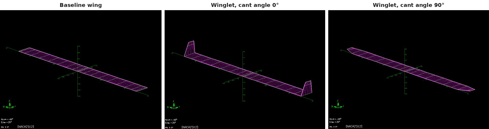
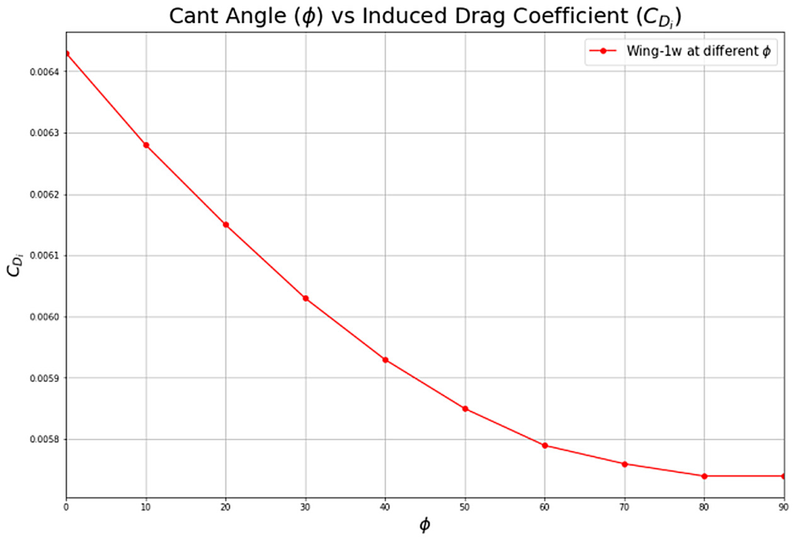

[← Back to portfolio](../)

# Winglet and Wing Planform Study with a Vortex Lattice Method

*Individual coursework, AE4130 Aircraft Aerodynamics, TU Delft, 2024. Analysed in AVL.*

**Aerodynamics:** vortex lattice method · induced drag · winglets · cant angle · wing sweep · dihedral · Trefftz plane analysis · span efficiency

**Modelling and analysis:** AVL · wing geometry definition · parametric study · Python

## Overview

This project compared a winglet with a wing tip extension for the reduction of induced drag, using the vortex lattice code AVL. A baseline wing was analysed at a cruise condition, a winglet was added, and its cant angle was varied from a vertical winglet to a horizontal tip extension. The effects of wing sweep and dihedral on the induced drag were calculated as well.

**My role:** individual work.

## Method

- **Baseline wing:** rectangular planform with a span of 25 m, a chord of 2.3 m and an area of 57.5 m², which gives an aspect ratio of 10.9.
- **Flight condition:** Mach number 0.6 at an altitude of 7000 m, at a wing lift coefficient of 0.5.
- **Winglet:** length 2 m, root chord 2.3 m, tip chord 1.15 m, leading-edge sweep 10°, NACA 0012 section.
- **Cant angle:** varied from 0° (vertical winglet) to 90° (tip extension) in steps of 10°.
- **Planform variations:** forward sweep of 40°, dihedral of 5°, and the combination of both.
- **Analysis:** the induced drag coefficient was taken from the Trefftz plane analysis of AVL. The reference area and reference span of the baseline wing were used for all configurations.

## Key Results

### 1. Baseline wing

The induced drag coefficient of the baseline wing is 0.00758, with a span efficiency of 0.968.

### 2. Effect of the winglet cant angle

| Cant angle | Induced drag coefficient | Change from the baseline wing |
|---|---|---|
| Baseline wing, no winglet | 0.00758 | |
| 0° (vertical) | 0.00643 | −15.2 % |
| 10° | 0.00628 | −17.2 % |
| 20° | 0.00615 | −18.9 % |
| 30° | 0.00603 | −20.4 % |
| 40° | 0.00593 | −21.8 % |
| 50° | 0.00585 | −22.8 % |
| 60° | 0.00579 | −23.6 % |
| 70° | 0.00576 | −24.0 % |
| 80° | 0.00574 | −24.3 % |
| 90° (tip extension) | 0.00574 | −24.3 % |

- The vertical winglet reduces the induced drag by 15 %.
- The induced drag decreases further as the winglet is canted outward, and the tip extension gives the largest reduction of 24 %.
- The change levels off above a cant angle of about 70°.

### 3. Effect of sweep and dihedral

| Configuration | Induced drag coefficient |
|---|---|
| Baseline wing | 0.00758 |
| Dihedral of 5° | 0.00755 |
| Forward sweep of 40° | 0.00751 |
| Forward sweep of 40° and dihedral of 5° | 0.00747 |

Sweep and dihedral change the induced drag by less than 1.5 %, which is small compared with the effect of the winglet.

## Limitations

- **Scope:** the comparison covers the induced drag only. The profile drag of the added surface, the wing root bending moment and the structural weight are not included, and these determine the choice between a winglet and a tip extension in a design.
- **Method:** the vortex lattice method is inviscid, with a compressibility correction for the Mach number.
- **Winglet design:** one winglet geometry was analysed. Its twist and its section were not optimised.

[← Back to portfolio](../)
