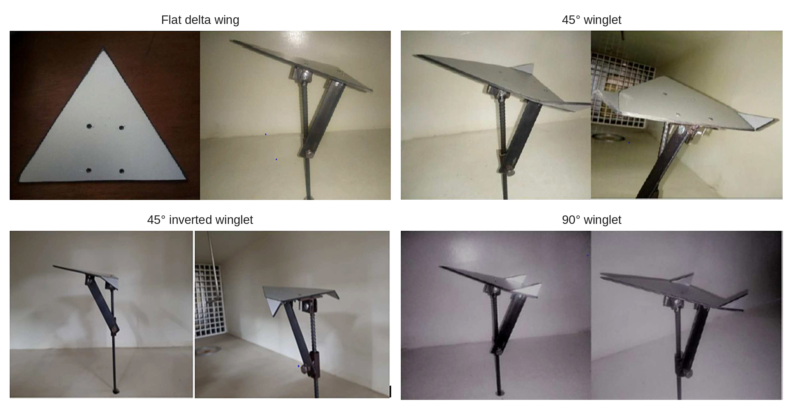
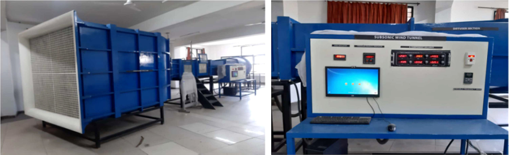

[← Back to portfolio](../)

# Delta Wing with Winglets: Low-Speed Wind Tunnel Force Measurements

*Undergraduate research project, Lovely Professional University, 2021. Published as: B. C. Mathew, P. Dutta, R. R. Savale and S. K. Sahu, "Aerodynamic and Experimental Investigation on a Delta Wing Incorporated with Winglets at Different Angles", Journal of Research in Engineering and Applied Sciences, Vol. 7, Issue 1, January 2022, pp. 204–211.*

**Experimental aerodynamics:** delta wing · winglets · low-speed wind tunnel testing · lift and drag measurements · spanwise flow

**Test engineering:** model design (Creo Parametric) · six-component balance · test matrix over angle of attack and velocity · data acquisition · technical publication

## Overview

This project compared a flat delta wing with three winglet configurations in a low-speed wind tunnel. Lift and drag were measured with a six-component balance over a range of angles of attack and freestream velocities, to assess the effect of the winglet angle on the forces. The spanwise flow over two of the winglet configurations was simulated in SimScale. The work was carried out during my bachelor's degree and led to a journal publication.

**My role:** co-author, second of four authors.

## Experimental Setup

- **Facility:** subsonic wind tunnel at Lovely Professional University, contraction ratio 9:1, with a six-component balance and data acquisition software.
- **Models:** four flat-plate delta wings: a baseline without winglets, and versions with 45° winglets, 45° inverted winglets and 90° winglets. The models were designed in Creo Parametric 2.0 and made of hard plastic with a thin aluminium coating.
- **Test matrix:** angle of attack 0°, 5°, 10°, 15° and 20°. Freestream velocity 10, 15, 20 and 25 m/s. This gives 20 measurement points per configuration.

## Method

- **Force measurements:** each model was mounted on the balance strut in the test section, and the forces were recorded at every combination of angle of attack and velocity.
- **Data reduction:** lift and drag were reduced to coefficients and plotted against angle of attack for each velocity.
- **Simulation:** the 45° and 90° winglet configurations were simulated in SimScale to compare the spanwise velocity near the wing tip.

## Results

- Force data are reported for the baseline, the 45° winglet and the 90° winglet configurations.
- At 15, 20 and 25 m/s, the measured lift increases with angle of attack up to 20° for all three configurations, with no stall inside the tested range. This is consistent with the delayed stall of delta wings.
- The paper concluded that the 90° winglet was the preferred configuration, based on the drag data and on the simulations, which showed a lower spanwise velocity toward the trailing edge of the 90° winglet than of the 45° winglet.

## Assessment

The reported coefficients increase with freestream velocity at a fixed angle of attack, and the drag coefficient becomes negative at the higher velocities. Both indicate that the balance readings were not fully corrected for zero offset and support tare loads. The absolute values are therefore not reliable, and the comparison between configurations is qualitative. The simulations were run at 80 m/s, so they are not directly comparable with the measurements at 10 to 25 m/s.

A repeat of this test would include wind-off zero measurements at every angle of attack, tare and interference runs for the support, repeat runs to quantify the scatter, and blockage corrections. These steps are part of the later wind tunnel work on this site.

[← Back to portfolio](../)
