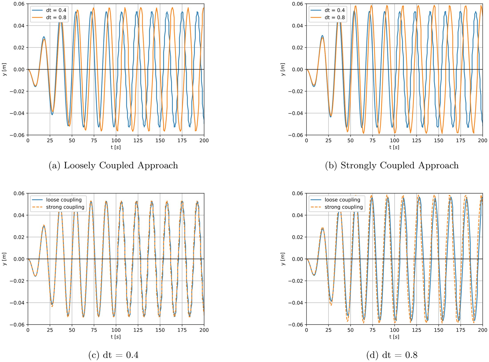
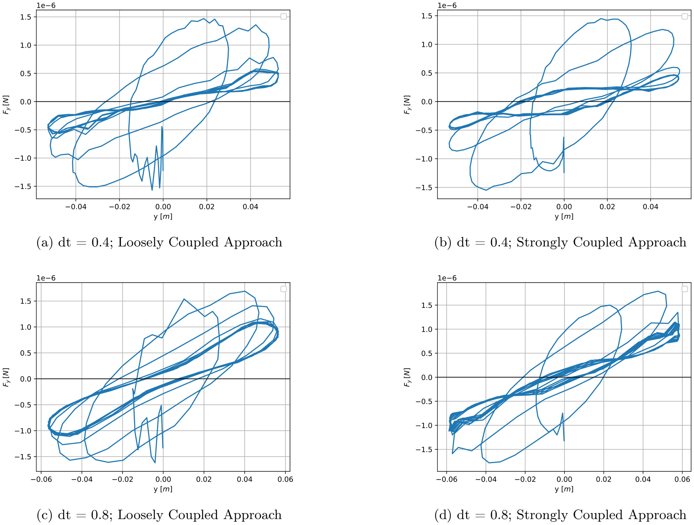
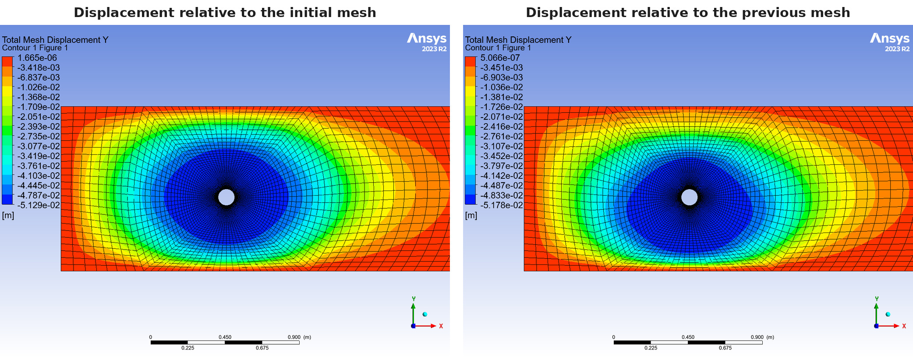
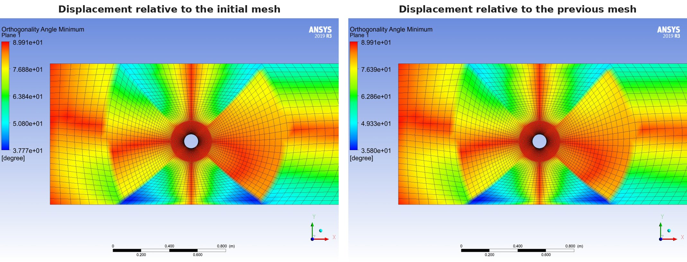

[← Back to portfolio](../)

# Vortex-Induced Vibration of a Cylinder: Fluid-Structure Interaction with Rigid-Body Coupling

*Group project (team of three), AE4117 Fluid-Structure Interaction, TU Delft, March 2024. Simulated in ANSYS CFX.*

**Computational fluid dynamics:** fluid-structure interaction · rigid-body coupling · vortex-induced vibration · lock-in · moving mesh · loosely and strongly coupled schemes · unsteady simulation

**Modelling and analysis:** ANSYS CFX · rigid-body solver · mesh deformation · time-step sensitivity study · comparison of coupling schemes · mesh quality assessment · analysis of the energy transfer

## Overview

A cylinder on an elastic support in a cross-flow vibrates when the frequency of the vortex shedding is close to the natural frequency of the support. This project simulated that condition, known as lock-in, as a two-way fluid-structure interaction in ANSYS CFX. The cylinder is modelled as a rigid body on a linear spring with one translational degree of freedom transverse to the flow. The rigid-body solver in CFX computes its motion from the fluid forces, and the fluid mesh deforms with the cylinder.

The objectives were to compare:

- a loosely coupled and a strongly coupled solution of the flow and the cylinder motion,
- two time steps,
- two methods of mesh deformation.

**My role:** member of a three-person team that set up and ran the simulations and wrote the report.

## Numerical Setup

- **Domain:** 60 × 10 × 1 cylinder diameters, with the cylinder at mid-height and 10 diameters from the inlet. The cylinder diameter is 0.1 m.
- **Flow:** air at 25 °C with an inlet velocity of 0.03 m/s, which gives a Reynolds number of 200.
- **Boundary conditions:** uniform velocity at the inlet, static pressure at the outlet, free-slip walls at the top and bottom. On the cylinder, a no-slip wall with the wall velocity equal to the mesh velocity.
- **Cylinder:** mass 0.001 kg and spring stiffness 1.42 × 10⁻⁴ N/m. The natural frequency is 0.060 Hz. With a Strouhal number of 0.2, the vortex shedding frequency is 0.06 Hz, so the frequency ratio is close to 1. The ratio of the fluid density to the cylinder density is 0.93.
- **Flow solver:** unsteady, second-order backward Euler time integration, SST turbulence model, with up to 50 coefficient loops per time step.
- **Coupling:** in the strongly coupled runs, the rigid-body solution is updated in every coefficient loop of a time step. In the loosely coupled runs, it is updated once per time step.
- **Mesh deformation:** displacement applied relative to the previous mesh in the baseline runs, and relative to the initial mesh in one comparison run.

### Simulation matrix

| Run | Time step | Coupling |
|---|---|---|
| 1 | 0.4 s | Loose |
| 2 | 0.4 s | Strong |
| 3 | 0.8 s | Loose |
| 4 | 0.8 s | Strong |

Each run covers 200 s of simulated time.

## Key Results

### 1. Cylinder response

In all four runs, the amplitude of the transverse displacement grows during the first cycles and then stays constant at 0.05 to 0.06 m, about half the cylinder diameter.

### 2. Effect of the time step and the coupling scheme

- **Coupling scheme:** at a time step of 0.4 s, the loosely and strongly coupled solutions nearly coincide. At 0.8 s, the strongly coupled solution has a slightly larger amplitude and the two solutions drift apart in phase.
- **Time step:** the two time steps give different oscillation periods and amplitudes. The time step therefore has a larger effect on the solution than the coupling scheme.

### 3. Energy transfer

The area enclosed by the loop of the fluid force against the displacement is the work done by the flow on the cylinder in one cycle. The loops are large while the amplitude grows, and they converge to a closed curve once the amplitude is constant.

### 4. Mesh deformation

Compared with the displacement relative to the initial mesh, the displacement relative to the previous mesh gives higher minimum orthogonality angles and lower mesh expansion factors near the cylinder. The aspect ratio is similar for the two methods.

## Limitations

- **Time-step convergence:** the solutions at 0.4 s and 0.8 s differ in period and amplitude, so the result is not converged in the time step. A smaller time step was not run.
- **Flow model:** the simulations used the SST turbulence model, although the wake at a Reynolds number of 200 is laminar. A laminar reference run is not included.
- **Model:** the flow is two-dimensional, and the cylinder has one degree of freedom.
- **Validation:** the amplitude was not compared with published data for this case.

[← Back to portfolio](../)
