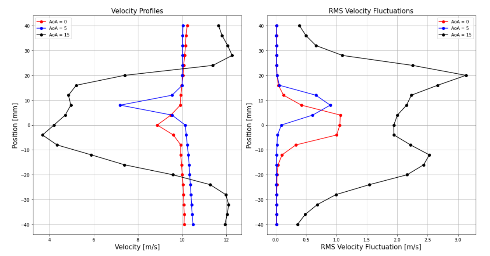
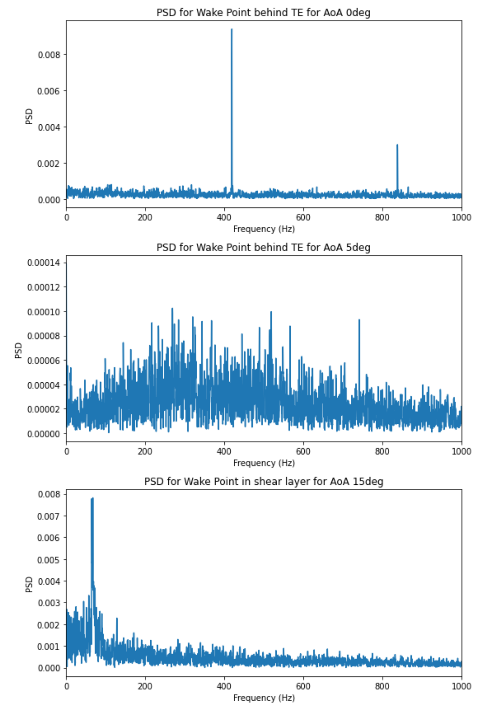
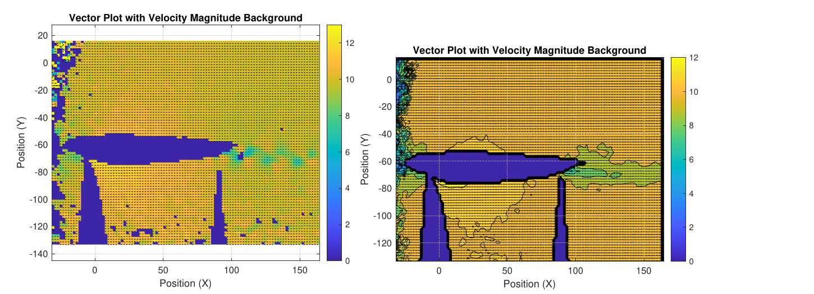
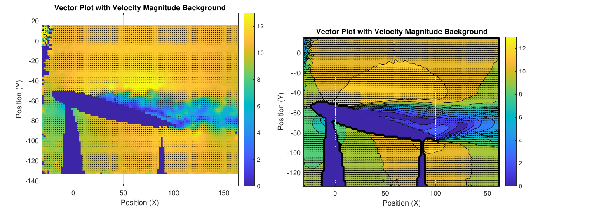
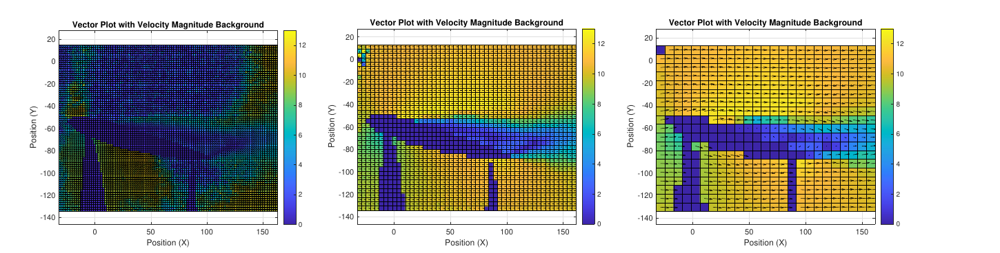
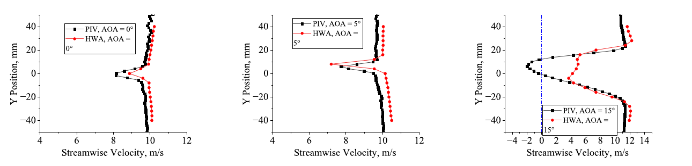
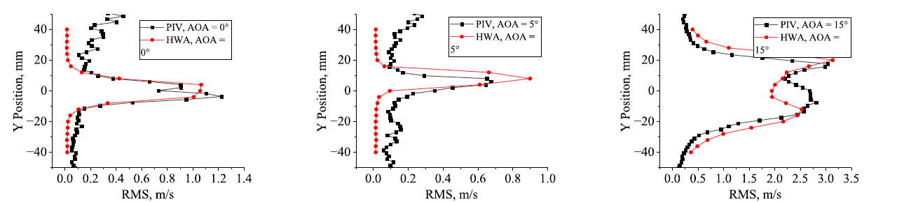

[← Back to portfolio](../)

# Hot-Wire Anemometry and PIV: NACA 0012 Wake

*Group lab exercise (team of four), AE4180 Flow Measurement Techniques, TU Delft, June 2024. Measured in the W-Tunnel.*

**Experimental aerodynamics:** hot-wire anemometry (CTA) · particle image velocimetry (PIV) · airfoil wake · vortex shedding · flow separation · velocity fluctuations · spectral analysis

**Test engineering:** sensor calibration against a Pitot-static reference · selection of overheat ratio and sampling parameters · PIV setup design · laser safety · data acquisition (LabVIEW, DaVis) · image processing and cross-correlation (MATLAB) · cross-validation of two measurement techniques

## Overview

This exercise measured the flow around a NACA 0012 airfoil at angles of attack of 0°, 5° and 15° with two techniques: a single-wire constant-temperature hot-wire anemometer and planar particle image velocimetry (PIV). Both were applied in the same wind tunnel at a freestream velocity of 10 m/s, and their results were compared in the wake of the airfoil.

The objectives were to:

- set up and calibrate a hot-wire anemometer and measure the mean velocity, the velocity fluctuations and the spectra in the wake,
- design and perform a planar PIV measurement of the flow field around the airfoil,
- compare the two techniques on the same wake and determine the limits of each, in particular in separated flow.

**My role:** member of a four-person team that performed the measurements, processed the data and wrote the report.

## Experimental Setup

- **Facility:** W-Tunnel, TU Delft, with a closed transparent test section of 0.40 m × 0.40 m. The freestream velocity of 10 m/s was set with a Pitot-static tube.
- **Model:** NACA 0012 airfoil made of Plexiglas, with a chord of 0.10 m, spanning the test section and rotated about the quarter-chord point.
- **Hot-wire anemometer:** platinum-plated tungsten wire of 5 µm diameter on a Dantec 56C17 constant-temperature bridge, acquired with a National Instruments data acquisition card in LabVIEW. The wake was traversed from −40 mm to +40 mm in 21 steps, about 20 % chord behind the trailing edge.
- **PIV system:** water-glycol fog with a mean particle diameter of about 1 µm, a Quantel Evergreen 200 Nd:YAG laser with a pulse duration of 8 ns, and a CCD camera with 1628 × 1236 pixels. Acquisition and processing were performed in DaVis. A cross-correlation code written in MATLAB was used for comparison. The laser safety procedures of the laboratory were applied.

## Method

### Hot-wire anemometry

- **Overheat ratio:** the cable and probe resistances were measured, and an overheat ratio of 0.5 was set. This value gives sufficient velocity sensitivity with a margin against overheating the wire.
- **Calibration:** the tunnel velocity was varied from 0 to 20 m/s in steps of 2 m/s against the Pitot-static reference, with 5 s of data at 2 kHz per point. A fourth-order polynomial was fitted between voltage and velocity. The test velocity of 10 m/s lies in the middle of the calibrated range.
- **Sampling:** the autocorrelation of the signal gave an integral time scale of 4 ms, which corresponds to a minimum sampling frequency of about 125 Hz for statistics. The wake was sampled at 10 kHz for 3 s to resolve the spectra beyond the shedding frequency.

### Particle image velocimetry

- **Setup design:** a field of view of 1.5 chords (0.15 m) gives a magnification of 0.048. With an f-number of 5.6, the depth of focus is about 4 cm, which exceeds the thickness of the laser sheet.
- **Image processing:** the airfoil and the two regions shadowed by refraction in the transparent model were masked. The background was removed by subtracting the minimum intensity of each pixel over 10 images. The velocity was computed by cross-correlation with multi-pass interrogation.
- **Parameter study:** the interrogation window size (16, 32 and 64 pixels), the overlap (0 % and 50 %), the pulse separation (75 µs and 6 µs) and the number of images (10 and 100) were varied. A window of 32 pixels with 50 % overlap and multi-pass interrogation was selected.

## Key Results

### 1. Wake profiles from the hot-wire

The velocity deficit and the fluctuation level in the wake increase with the angle of attack. At 0° the deficit is narrow and centred behind the trailing edge. At 5° it is displaced upward. At 15° the wake is wide, with shear layers on both sides and velocity fluctuations above 3 m/s.

### 2. Spectra

- **0°:** the spectrum has a single dominant peak at about 420 Hz with a harmonic near 840 Hz, which indicates periodic vortex shedding from the trailing edge.
- **5°:** the energy is distributed over a broad band of frequencies.
- **15°:** in the shear layer, the energy is concentrated below 100 Hz, which indicates larger vortical structures in the separated flow.

These frequencies are outside the range of the PIV system, which acquires at a maximum of 15 Hz.

### 3. Flow fields from PIV

At 0° the mean flow is symmetric about the airfoil, with a thin wake. At 15° the flow is separated: the mean field contains a recirculation region above the airfoil with reversed flow toward the trailing edge, and the instantaneous field shows vortical structures of different sizes in the shear layer.

### 4. Effect of the PIV processing parameters

- **Window size:** with a window of 16 pixels, particles leave the window between the two frames in the high-velocity region over the suction side, and the correlation returns velocities near zero there. A window of 64 pixels does not resolve the shear layer or the stagnation point. A window of 32 pixels resolves both.
- **Pulse separation:** a separation of 6 µs gives a noisy field, because the particle displacement is small compared with the measurement error.
- **Number of images:** the mean field from 100 images is smoother than the mean field from 10 images.

### 5. Comparison of the two techniques on the same wake

- **Attached flow (0° and 5°):** the streamwise velocity profiles of the two techniques agree closely. The hot-wire values are slightly higher, which is attributed to calibration bias and to differences in the processing.
- **Separated flow (15°):** the profiles differ in the separated region. PIV measures negative velocities near the centre of the wake, because it resolves the direction of the flow. A single hot-wire responds to the velocity magnitude only and returns positive values there.
- **Fluctuations:** the fluctuation profiles agree better at 15°, because the fluctuation level does not depend on the sign of the velocity.

### 6. Assessment of the techniques

| | Hot-wire anemometry | PIV |
|---|---|---|
| Strengths | High temporal resolution. Short setup and processing time. | Measures the whole field. Non-intrusive. Resolves the flow direction. Requires no velocity calibration. |
| Limits | Requires calibration. Intrusive. Point measurement. A single wire does not resolve reversed flow. | Low temporal resolution. Requires optical access. More sources of error in setup and processing. |

The two techniques are complementary for this flow. PIV shows where the flow separates and in which direction it moves, and the hot-wire resolves the frequency content of the wake.

## Limitations

- **Hot-wire in separated flow:** a single-wire probe does not distinguish the flow direction, so its mean velocity in the reversed-flow region at 15° is not valid.
- **PIV temporal resolution:** the system acquires at a maximum of 15 Hz, so the PIV data give statistics and instantaneous fields but no spectra.
- **PIV coverage:** two regions near the transparent model are shadowed by refraction of the laser sheet and contain no data.
- **Agreement between the techniques:** the small offset between the hot-wire and PIV velocities at 0° and 5° was not resolved further.

[← Back to portfolio](../)
