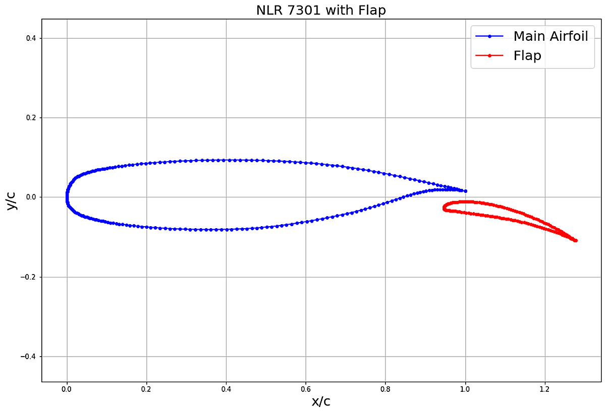
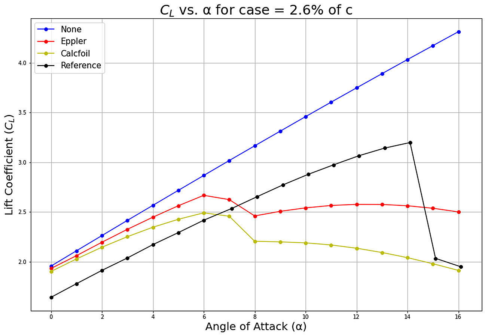
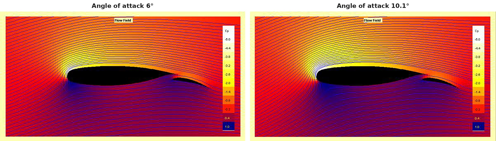

[← Back to portfolio](../)

# Two-Element High-Lift Airfoil in JavaFoil: Panel Method against Experiment

*Individual coursework, AE4130 Aircraft Aerodynamics, TU Delft, 2024. Analysed in JavaFoil, with the results plotted in Python.*

**Aerodynamics:** multi-element airfoil · high-lift devices · slotted flap · panel method · stall prediction · Reynolds number effects · NLR 7301

**Modelling and analysis:** JavaFoil · Python · geometry preparation · comparison with experimental data · comparison of stall models

## Overview

This project analysed the NLR 7301 airfoil with a trailing-edge flap in JavaFoil, a panel method coupled with an integral boundary-layer analysis. The objective was to determine how well a low-fidelity method predicts the lift of a two-element airfoil, by comparing its lift curve with experimental reference data up to stall.

The same case was simulated with the RANS equations in a separate project: [RANS Simulation of a Two-Element High-Lift Airfoil](rans-high-lift).

**My role:** individual work.

## Method

- **Geometry:** main element and flap at a flap deflection of 20° and a gap of 2.6 % chord. The cove of the main element was replaced by a smooth contour, which the panel method requires.
- **Conditions:** Reynolds number 2.51 × 10⁶ and Mach number 0.185, with the transition fixed at 2 % chord on both elements.
- **Stall models:** three settings of JavaFoil were compared: no stall correction, the Eppler stall model and the Calcfoil stall model.
- **Additional cases:** a Reynolds number of 1 × 10⁵, and the main element with the flap retracted.

## Key Results

### 1. Lift curve against the experiment

| Case | Lift coefficient at 6° | Maximum lift coefficient | Angle of attack at maximum lift |
|---|---|---|---|
| Experiment | 2.42 | 3.20 | 14° |
| JavaFoil, no stall correction | 2.87 | no stall predicted | |
| JavaFoil, Eppler stall model | 2.67 | 2.67 | 6° |
| JavaFoil, Calcfoil stall model | 2.49 | 2.49 | 6° |

*JavaFoil values read from the plotted curves.*

- **Without a stall correction,** the lift curve is linear over the whole range and lies above the experiment.
- **With the stall models,** the lift at 6° is 3 % to 10 % above the experiment. Both models predict the maximum lift at 6°, while the measured lift increases up to 14°. The maximum lift is underpredicted by 17 % to 22 %.

### 2. Comparison with the RANS simulation

| Angle of attack | Experiment | RANS, fine grid | JavaFoil, Eppler stall model |
|---|---|---|---|
| 6° | 2.416 | 2.400 | 2.67 |
| 13.1° | 3.141 | 3.161 | 2.58 |

The RANS simulation predicts the lift within 0.7 % at both angles of attack. The panel method is about 10 % above the experiment at 6° and 18 % below it at 13.1°, where the flow over the two elements is governed by viscous effects that the method does not represent.

### 3. Flow field

The pressure field and the streamlines show the stagnation points on both elements, the suction region over the nose of the main element and the flow through the gap onto the upper side of the flap.

### 4. Flap retracted and Reynolds number

- **Flap retracted:** the maximum lift coefficient of the main element alone is about 1.4, against about 2.7 with the flap deployed for the same stall model.
- **Reynolds number:** at a Reynolds number of 1 × 10⁵, the predicted lift drops at individual angles of attack and otherwise follows the curve at the high Reynolds number.

## Limitations

- **Method:** the stall models are empirical corrections for single airfoils. The panel method does not represent the interaction between the wake of the main element and the boundary layer on the flap, which determines the maximum lift of a multi-element airfoil.
- **Low Reynolds number:** the lift drops at individual angles of attack at a Reynolds number of 1 × 10⁵ are irregular and were not investigated further.
- **Data:** the JavaFoil values in the tables are read from the plotted curves.

[← Back to portfolio](../)
