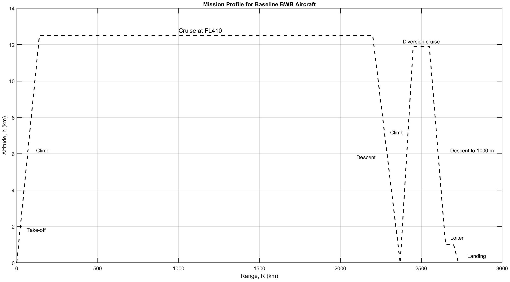
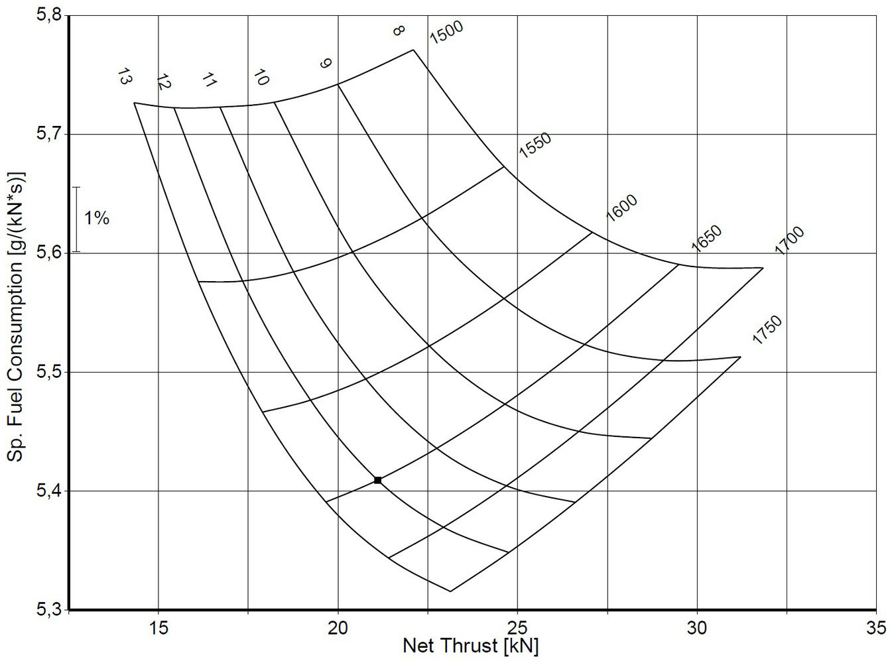
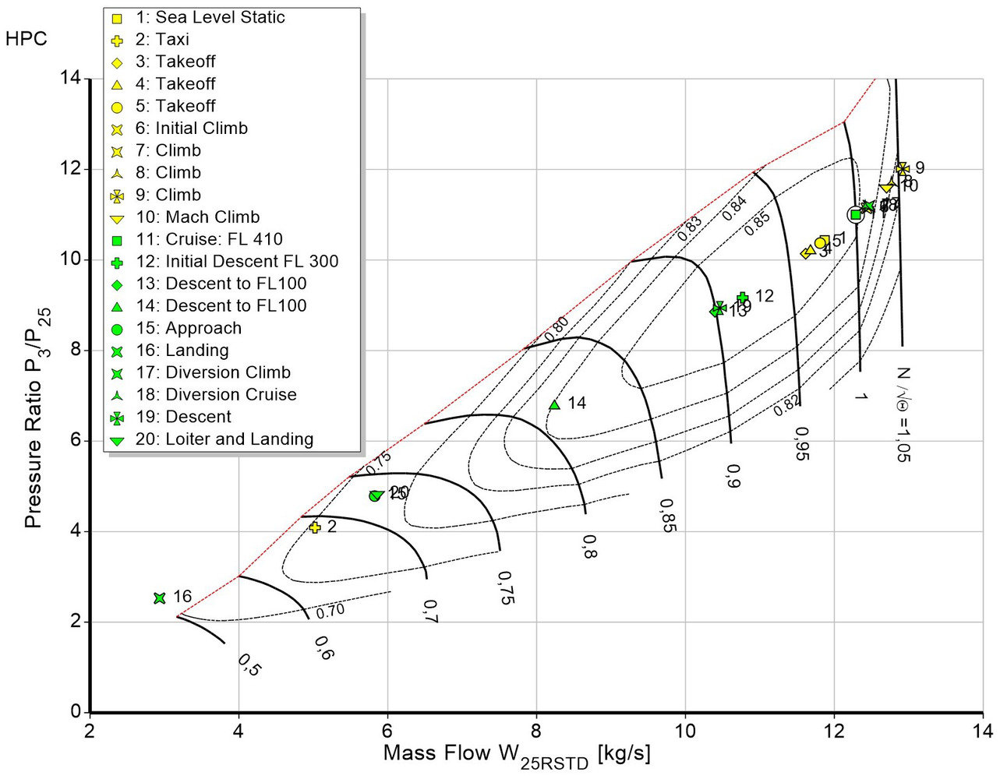
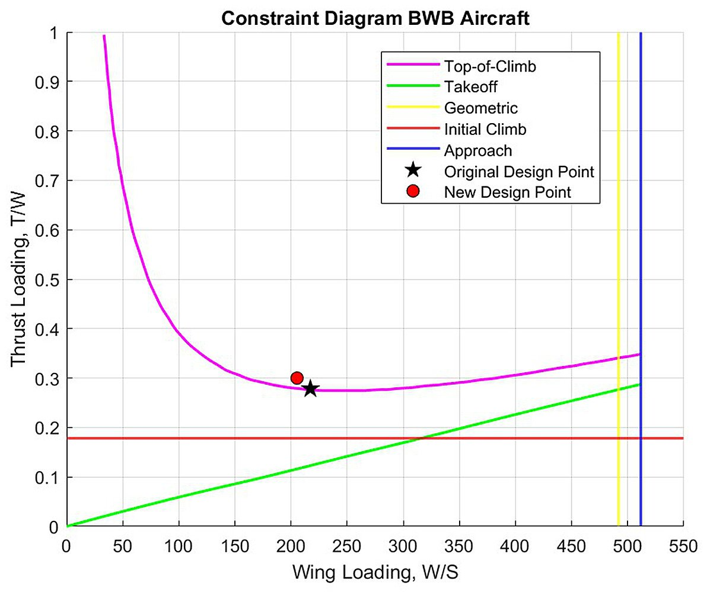

[← Back to portfolio](../)

# Hydrogen-Powered Blended Wing Body Aircraft: Joint Interdisciplinary Project with Airbus

*Joint Interdisciplinary Project (IFM4040), TU Delft, September to November 2024. Team of seven students from three faculties, with Airbus Netherlands as the industry partner.*

**Aircraft and propulsion:** blended wing body · liquid hydrogen · turbofan cycle design · boundary layer ingestion · mission analysis · cryogenic fuel storage · aircraft weight estimation · CO2-equivalent emissions

**Project work:** industry collaboration · interdisciplinary teamwork · conceptual design study · literature review · expert interviews · technical reporting

## Overview

This ten-week project, with Airbus Netherlands as the industry partner, addressed one question: what role can blended wing body (BWB) aircraft play in bringing aviation to net-zero emissions by 2050? The team combined a technical analysis of the aircraft, its fuel and its propulsion system with a business, financial, risk and ethics analysis of its introduction.

The technical analysis compared three combinations of fuel and propulsion for a medium-range BWB on a route within Europe:

1. **Conventional case:** kerosene and a turbofan engine.
2. **Transitional case:** liquefied natural gas in a multi-fuel configuration.
3. **Future case:** liquid hydrogen with an engine designed for it.

The final proposal is a BWB with liquid hydrogen engines and boundary layer ingestion. Its in-flight emissions on the reference route were quantified and compared with a current single-aisle aircraft.

**My role:** worked on the technical analysis in a seven-person interdisciplinary team: mission and baseline aircraft definition, fuel selection, sizing calculations for the hydrogen engine, tank and weight estimation, and the emissions comparison.

## Technical Analysis

The results in this section are the work of the technical part of the team.

### 1. Mission and baseline aircraft

- **Reference route:** London to Athens, 2428 km, a route flown by single-aisle aircraft of the A320 family.
- **Mission profile:** cruise at flight level 410 (12.5 km) and Mach 0.78, with a nominal flight time of 3 hours 26 minutes, followed by a 70-minute diversion and loiter for the reserve fuel.
- **Baseline aircraft:** a 150-passenger BWB with a range of 2750 nautical miles, taken from a published multidisciplinary design study that used the same top-level requirements as the A320neo.

| Quantity | A320neo reference, 2035 technology | Baseline BWB |
|---|---|---|
| Maximum take-off weight | 67.8 t | 74.2 t |
| Operating empty weight | 38.6 t | 47.1 t |
| Wing area | 115.7 m² | 341.6 m² |
| Maximum lift-to-drag ratio | 17.2 | 23.6 |
| Cruise altitude | 35,700 ft | 40,800 ft |

### 2. Selection of the fuel

- **Kerosene:** the BWB reduces the fuel burn through its higher lift-to-drag ratio, but the emissions remain carbon-based.
- **Liquefied natural gas:** lower emissions than kerosene, and the BWB offers the volume for the cryogenic tanks that a conventional aircraft lacks. The team treated it as a transitional option.
- **Liquid hydrogen:** no carbon emissions in flight. Its low volumetric energy density requires large tanks, which fit in the transition region between the centre body and the outer wing of a BWB. It was selected for the final proposal.

### 3. Engine design

The team modelled a liquid hydrogen turbofan in GasTurb 14.

- **Sizing:** the design point is the top of climb, at 12,500 m and Mach 0.78, with a required net thrust of 21.1 kN per engine.
- **Parametric study:** the bypass ratio was varied from 8 to 13 and the turbine inlet temperature from 1500 K to 1750 K, to find the lowest specific fuel consumption at the required thrust. The turbine inlet temperature was limited to 1650 K for the turbine materials and the NOx emissions.

| Parameter | Value |
|---|---|
| Engine type | Unmixed two-spool turbofan |
| Bypass ratio | 12 |
| Fan pressure ratio | 1.43 |
| Turbine inlet temperature | 1650 K |
| Net thrust at the design point | 21.1 kN |
| Thrust-specific fuel consumption | 5.41 g/(kN·s) |
| Engine weight | 2415 kg |

- **Off-design performance:** the engine was simulated at every point of the nominal and diversion mission. All points remain inside the surge limit of the high-pressure compressor.

### 4. Fuel, tanks and aircraft weights

- **Mission fuel:** 2.81 t of liquid hydrogen for the flight from London to Athens, and 3.93 t including the diversion, a contingency of 5 % and the boil-off.
- **Tanks:** cylindrical, non-integral tanks with foam insulation. The tank weight was estimated from a ratio of fuel weight to tank weight of 6, the cryogenic fuel system as 15 % of the tank weight, and the boil-off as 0.1 % of the fuel per hour.
- **Aircraft weights:** with the new engines, the tanks and the fuel system, the operating empty weight changes from 47.1 t to 47.4 t and the maximum take-off weight from 74.2 t to 70.2 t, a reduction of 5.4 %.
- **Design point:** the lower weight shifts the design point of the aircraft to a lower wing loading and a higher thrust loading.

### 5. Propulsion integration

Boundary layer ingestion was assessed from the literature and proposed as the propulsion configuration. Engines that ingest the boundary layer of the centre body need less propulsive power for the same thrust and reduce the drag of the aircraft. The drawbacks are the distorted inflow at the fan and the effect of thrust changes on the pitch behaviour of a tailless aircraft at low speed.

### 6. Emissions

The in-flight emissions on the reference route were converted to CO2-equivalent emissions with a model for the global warming potential of water vapour and NOx as a function of altitude.

| Quantity for London to Athens | A320neo, kerosene | BWB, liquid hydrogen |
|---|---|---|
| CO2 | 24.1 t | 0 |
| Water vapour | 9.5 t | 25.3 t |
| NOx | 0.11 t | 0.012 t |
| CO2-equivalent emissions | 33.7 t | 12.6 t |

- The CO2-equivalent emissions of the hydrogen BWB are 37 % of those of the A320neo, a reduction of 63 %.
- The remaining climate effect comes from water vapour, whose warming potential increases with altitude. The altitude of best aerodynamic efficiency (12.5 km) is therefore higher than the altitude of lowest climate effect (about 12.1 km).

## Non-Technical Findings

This part of the project was carried out by the team members from the other disciplines.

- **Direct operating cost:** two cost models were applied to the reference route for the year 2050. The hydrogen BWB has a direct operating cost about 4 % to 8 % above an A320neo, and up to about 6 % above an advanced A320neo on sustainable aviation fuel. The fuel cost is lower, and the capital cost is higher.
- **Acquisition price:** the BWB was assumed to cost 37 % more than a comparable conventional aircraft, the upper end of published estimates.
- **Stakeholders:** airlines were identified as the group with the largest influence on the success of the aircraft.
- **Risk and ethics:** the main risks are technology readiness, hydrogen availability and public acceptance. The report proposes mitigation measures for each.
- **Recommendations to Airbus:** develop hydrogen-compatible BWB designs, form partnerships for hydrogen supply and storage, invest in boundary layer ingestion and distributed propulsion, and run pilot programmes with airlines.

## Limitations

- **Baseline aircraft:** the weights of the baseline BWB come from a published study with material technology projected for 2035. The wing area, the lift-to-drag ratio and the cruise altitude were kept constant when the hydrogen system was added. A full resizing of the aircraft was outside the scope.
- **Engine sizing:** the engine was sized for the top-of-climb thrust of the baseline aircraft and not resized for the lighter hydrogen aircraft. The fuel burn in cruise is therefore conservative. A check with the Breguet range equation differed from the engine simulation by about 20 % in cruise.
- **Tank weight:** the ratio of fuel weight to tank weight is an assumption read from published data.
- **Emissions:** only in-flight emissions are included. The emissions from the production of hydrogen are not, and the mission assumes no wind.

[← Back to portfolio](../)
