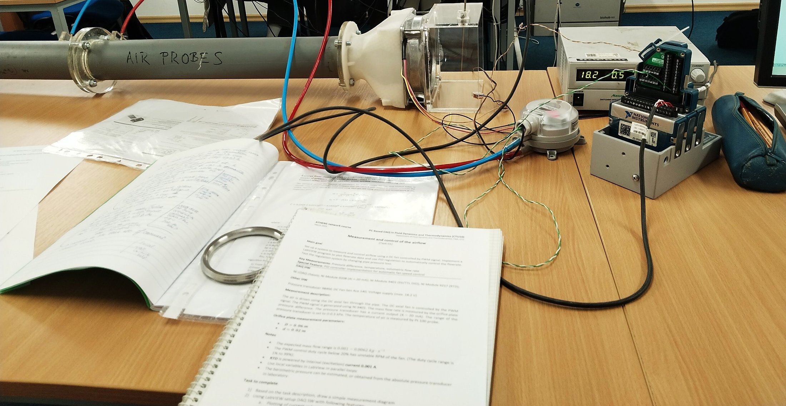
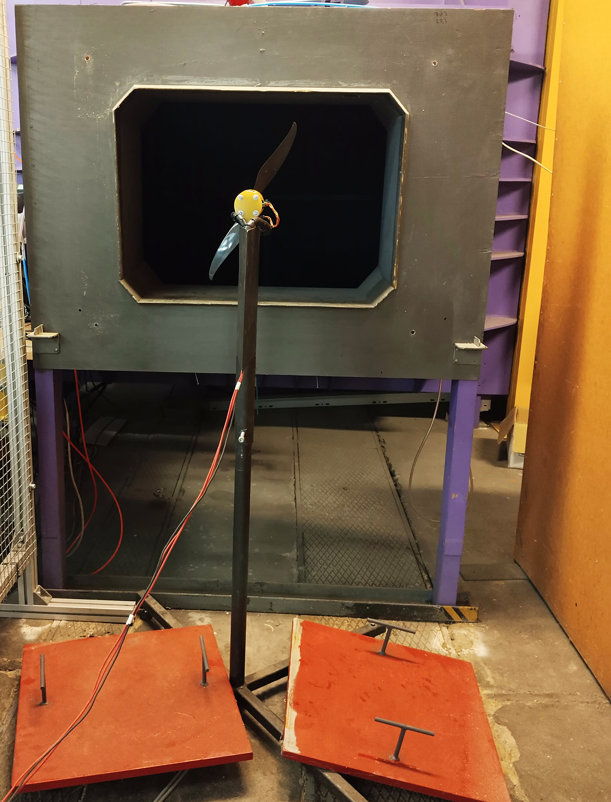
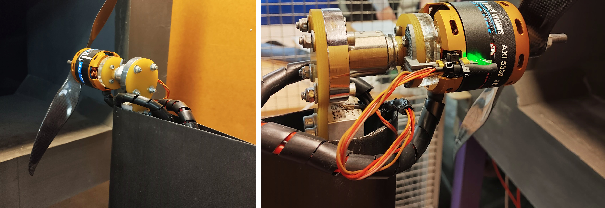
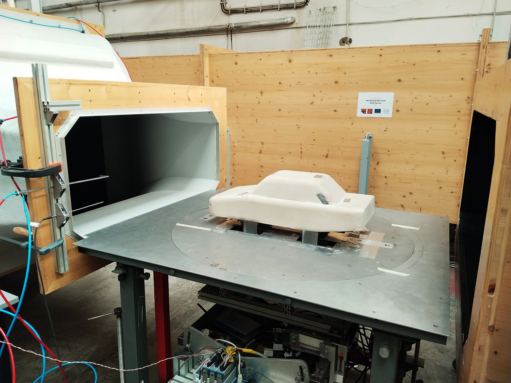

[← Back to portfolio](../)

# PC-Based Data Acquisition in LabVIEW: Four Fluid Dynamics Experiments

*ATHENS programme course CTU10, "PC Based DAQ in Fluid Dynamics and Thermodynamics", Department of Fluid Dynamics and Thermodynamics, Czech Technical University in Prague, 15–22 March 2025.*

**Experimental aerodynamics:** open-jet wind tunnel · propeller characteristics · aerodynamic forces on a body · orifice-plate flow measurement · moist air properties

**Test engineering:** LabVIEW · NI CompactDAQ · data acquisition · sensor integration (4–20 mA transducer, Pt100, load cell) · PWM actuation · PID control · data logging

## Overview

This one-week course covered PC-based data acquisition for fluid dynamics and thermodynamics experiments. The theory sessions covered the measurement of pressure, temperature, humidity, force, velocity and flow rate, the transmission of sensor signals to a data acquisition system, and LabVIEW programming. In the laboratory, the participants worked in four groups that rotated through four experiments, with two laboratory sessions per experiment. For each one, a LabVIEW program was written on National Instruments CompactDAQ hardware to acquire the sensor signals, run the test and log the data.

**My role:** built the LabVIEW interfaces for the four experiments: reading the sensors, running the test and logging the data.

## Experiments

### 1. Measurement and control of the air mass flow rate in a channel

- **Objective:** measure the airflow through a pipe and control it automatically.
- **Rig:** A DC axial fan (San Ace 140) drives air through a pipe. The mass flow rate is obtained from the pressure difference across an orifice plate with a pipe diameter of 60 mm and an orifice diameter of 20 mm. The expected mass flow range is 0.001 to 0.0062 kg/s.
- **Data acquisition:** NI CompactDAQ chassis with an NI 9208 current input module for the differential pressure transducer (4–20 mA output), an NI 9217 module for the Pt100 air temperature probe, and an NI 9401 digital module that generates the PWM signal for the fan.
- **LabVIEW program:** calculates and plots the flow rate and regulates it with a PID controller acting on the PWM duty cycle of the fan. The controller was tested by changing the pressure loss of the pipe.

### 2. Measurement of thermodynamic properties of moist air

- **Objective:** determine the thermodynamic properties of moist air from measured quantities.

### 3. Measurement of air propeller characteristics in a wind tunnel

- **Objective:** measure the characteristics of a propeller in an airstream.
- **Rig:** a two-blade propeller driven by a brushless motor (AXI 5330), mounted on an instrumented stand at the nozzle exit of an open-jet wind tunnel. The motor mount carries a load cell for force measurement.

### 4. Measurement of basic aerodynamic properties of a solid body in a wind tunnel

- **Objective:** measure the basic aerodynamic properties of a solid body in a steady airflow.
- **Rig:** a vehicle-shaped body mounted on a turntable at the nozzle exit of an open-jet wind tunnel, with probes at the nozzle for the flow velocity.

[← Back to portfolio](../)
