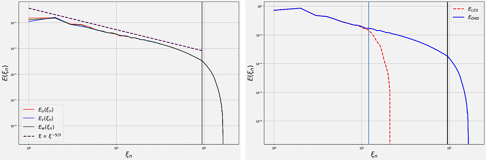
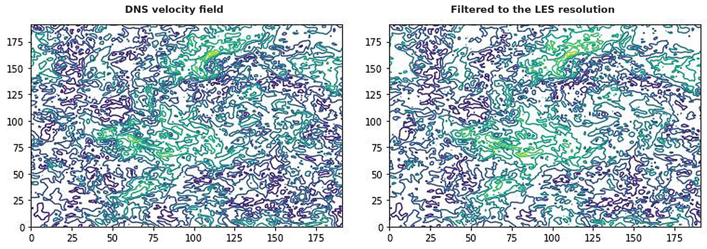
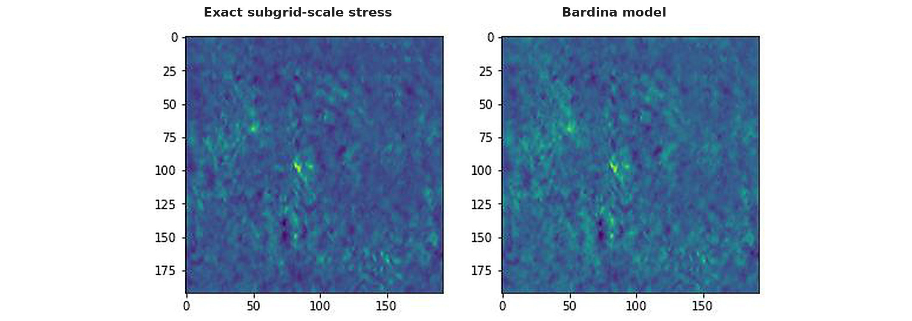
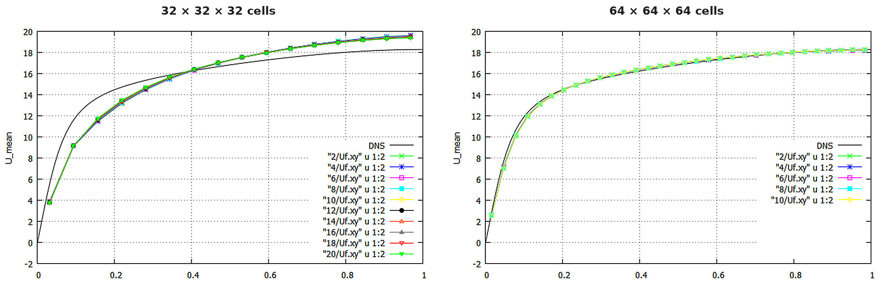
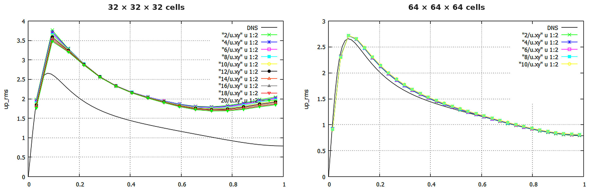
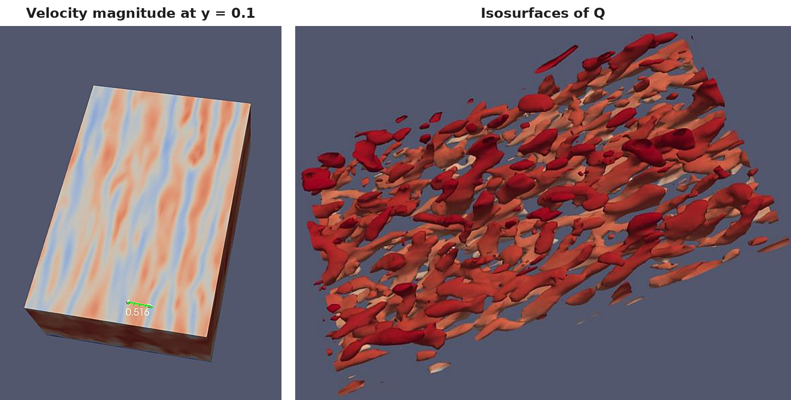

[← Back to portfolio](../)

# Large Eddy Simulation: DNS Data Analysis and Turbulent Channel Flow

*Individual coursework, AE4139 CFD 3: Large Eddy Simulation, TU Delft, April 2024. Python and OpenFOAM.*

**Computational fluid dynamics:** large eddy simulation · subgrid-scale modelling · Smagorinsky model · dynamic Smagorinsky model · van Driest damping · Bardina model · homogeneous isotropic turbulence · turbulent channel flow

**Modelling and analysis:** OpenFOAM · ParaView · Python (NumPy FFT) · spectral analysis · spatial filtering · energy and dissipation spectra · comparison with DNS data · grid and model sensitivity study · vortex identification (Q and λ2 criteria)

## Overview

This coursework covered large eddy simulation (LES) in two parts:

1. **Analysis of DNS data in Python.** A velocity field from a direct numerical simulation (DNS) of homogeneous isotropic turbulence was analysed, filtered to a typical LES resolution, and used to compare subgrid-scale models with the exact subgrid-scale stress.
2. **LES of a turbulent channel flow in OpenFOAM.** A low-Reynolds-number channel flow was simulated on two grids with five combinations of subgrid-scale model and convective scheme, and compared with DNS data.

**My role:** individual work. I wrote the analysis code for the first part, and ran and post-processed all simulations of the second part. The channel simulations started from the OpenFOAM case files provided in the course, with the subgrid-scale model and the convective scheme changed for each run.

## 1. Analysis of DNS Data

### Method

- **Data:** one instantaneous velocity field from a pseudo-spectral DNS, on 192³ points in a periodic box with a side length of 2π and a kinematic viscosity of 0.0008.
- **Verification of the transforms:** the supplied Fourier modes were reproduced by a three-dimensional FFT of the physical field, and the physical field by the inverse FFT.
- **Statistics:** turbulence kinetic energy, dissipation rate, three-dimensional energy spectrum and dissipation spectrum. The kinetic energy and the dissipation rate were computed in physical space, in spectral space and from the spectra, to check the implementation.
- **Filtering:** the field was filtered in spectral space with a box filter that corresponds to a finite-volume grid of 24³ cells, with all modes above the Nyquist wavenumber of 12 removed.
- **Subgrid-scale stress:** the exact stress was computed from the DNS field and its filtered counterpart, and compared with the stress from the Smagorinsky model (model constant 0.17) and from the Bardina scale-similarity model.

### Results

| Quantity | Value |
|---|---|
| Turbulence kinetic energy | 2.51 |
| Dissipation rate | 0.845 |
| Large-scale Reynolds number | 9322 |
| Taylor microscale | 0.154 |
| Taylor-scale Reynolds number | 249 |
| Kolmogorov constant | 1.58 |

- **Divergence:** the rms divergence of the velocity field is of the order of 10⁻¹⁹ with spectral differentiation and 2.47 with second-order central differences. The field is divergence-free in the discretisation it was computed with. The second value is the truncation error of the finite-difference scheme on this field.
- **Energy spectrum:** the spectrum follows the −5/3 slope of the Kolmogorov scaling in the inertial range. The Kolmogorov constant evaluated from the data is 1.58, against a value of about 1.5 from experiments.
- **Filtering:** the energy spectrum of the filtered field follows the DNS spectrum at low wavenumbers and falls off steeply around the cut-off wavenumber. The large structures of the velocity field are retained and the small structures are removed.

- **Subgrid-scale models:** the stress from the Bardina model reproduces the spatial distribution of the exact subgrid-scale stress. The stress from the Smagorinsky model shows a poor agreement with the exact stress.

## 2. LES of a Turbulent Channel Flow

### Method

- **Case:** incompressible flow between two parallel walls in a domain of 6 × 2 × 4 channel half-heights, periodic in the streamwise and spanwise directions, driven by a constant mean pressure gradient. The viscosity follows from the force balance between the pressure gradient and the wall shear stress, for a friction Reynolds number of about 180.
- **Solver:** OpenFOAM, finite-volume method with the PISO algorithm and second-order backward time integration.
- **Grids:** 32 × 32 × 32 cells and 64 × 64 × 64 cells.
- **Post-processing:** profiles of the mean velocity and of the velocity fluctuations at several averaging times, compared with DNS data. Flow structures were visualised in ParaView.

### Simulation matrix

| Run | Subgrid-scale model | Convective scheme |
|---|---|---|
| 1 | Smagorinsky, constant 0.065 (suited to low-Reynolds-number channel flow) | Central |
| 2 | Smagorinsky, constants suited to isotropic turbulence (0.14, 0.20 and 0.25) | Central |
| 3 | Smagorinsky, constant 0.065, with van Driest damping | Central |
| 4 | Smagorinsky, constant 0.065 | Upwind |
| 5 | Volume-averaged dynamic Smagorinsky | Central |

All five runs were made on both grids. On the fine grid, run 2 used a constant of 0.20 only.

### Results

- **Grid resolution:** on the 32³ grid, the mean velocity profile deviates from the DNS data for all five runs, and the peak of the streamwise velocity fluctuation is overpredicted (about 3.6 against 2.65 in the DNS data). On the 64³ grid, the mean velocity profile matches the DNS data and the peak of the streamwise fluctuation is within a few percent of the DNS value.

- **Model constant:** the larger constants suited to isotropic turbulence give a larger eddy viscosity and increase the deviation from the DNS data, most clearly in the streamwise velocity fluctuation.
- **Convective scheme:** the upwind scheme is less accurate than the central scheme and gives a larger spread between the profiles at different averaging times.
- **van Driest damping and dynamic model:** both produced only small changes in the profiles at these resolutions.
- **Eddy viscosity:** the maximum eddy viscosity is higher on the 32³ grid than on the 64³ grid, because the coarser grid leaves a larger part of the turbulence to the model.
- **Near-wall streaks:** the mean spanwise spacing of the streaks at a wall distance of 0.1 is 0.55 channel half-heights. With the known spacing of about 100 wall units, this gives a friction Reynolds number of about 182, consistent with the nominal value.
- **Vortex structures:** isosurfaces of the Q and λ2 criteria show vortices inclined at about 9° to 17° to the wall. Only a few hairpin vortices are resolved on the 64³ grid.

## Limitations

- **DNS data analysis:** the analysis uses a single snapshot. The comparison of the modelled and exact subgrid-scale stresses is visual, and correlation coefficients were not computed.
- **Channel flow, resolution:** the wall-normal and spanwise velocity fluctuations remain below the DNS data on the 64³ grid, so the simulation is not grid-converged.
- **Channel flow, statistics:** the profiles are averaged over a limited simulation time, and the remaining differences between successive averaging times indicate the statistical uncertainty.

[← Back to portfolio](../)
