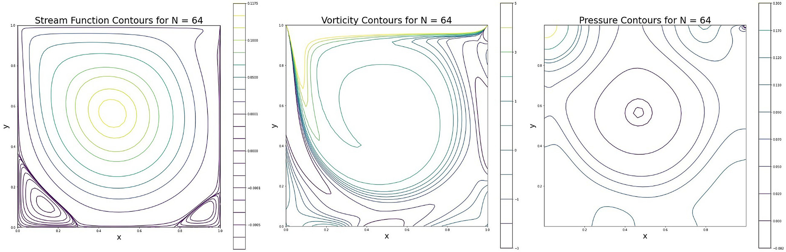
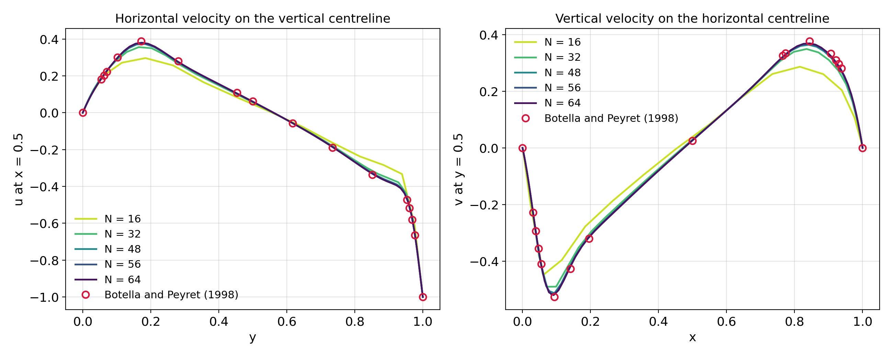

[← Back to portfolio](../)

# Incompressible Navier-Stokes Solver: Lid-Driven Cavity Validation

*Group project (team of two), AE4136 CFD 2: Discretization Techniques, TU Delft, May 2024. Written in Python.*

**Computational fluid dynamics:** incompressible Navier-Stokes equations · staggered primal and dual grids · incidence and Hodge matrices · pressure Poisson equation · explicit time marching · lid-driven cavity

**Modelling and analysis:** Python (NumPy, SciPy sparse matrices) · numerical solver development · verification of discrete operators · grid convergence study · validation against benchmark data

## Overview

This project implemented a solver for the two-dimensional incompressible Navier-Stokes equations on a unit square and validated it on the lid-driven cavity flow at a Reynolds number of 1000. The discretisation separates the equations into two kinds of operators:

- **Incidence matrices** represent the divergence, gradient and curl. They contain only the connectivity of the mesh and are exact.
- **Hodge matrices** transfer the unknowns between the primal grid and the dual grid. They contain the mesh dimensions and carry the approximation of the method.

The results were compared with the spectral benchmark solution of Botella and Peyret (1998).

The course provided a solver skeleton with the grid generation and the time-marching loop. The incidence matrices, the Hodge matrices, the treatment of the boundary conditions, the selection of the time step and the convergence tolerance, and the post-processing were written for this project.

**My role:** member of a two-person team that wrote the code and the report.

## Method

- **Formulation:** the momentum equation is written in rotational form, with the vorticity as an additional variable. The unknowns are the velocity fluxes through the cell edges, the pressure in the cells and the vorticity at the grid points.
- **Grid:** N × N cells with cosine clustering toward the walls, together with the corresponding dual grid.
- **Discrete operators:** the incidence matrices for the divergence, the gradient and the curl are assembled as sparse matrices for any N. The Hodge matrices are diagonal and contain the edge-length ratios and the cell areas of the two grids.
- **Boundary conditions:** the lid velocity and the no-slip walls are imposed through additional edges along the boundary. Their prescribed values move to the right-hand side of the system.
- **Time integration:** explicit time marching to the steady state. In each step, a Poisson equation is solved for the pressure with a sparse LU factorisation that is computed once, and the velocity is then updated.
- **Time step:** the largest stable time step was found by trial, at 5.5 times the estimate provided with the skeleton. The solution diverged for larger values.
- **Convergence tolerance:** tolerances from 10⁻⁵ to 10⁻¹⁰ on the rate of change of the velocity were compared at N = 48. A tolerance of 10⁻⁶ was selected: it required 40.8 s of CPU time, against 81.4 s for 10⁻⁸ and 121 s for 10⁻¹⁰.
- **Grids:** N = 16, 32, 48, 56 and 64.

## Key Results

### 1. Flow field

At N = 64, the solution contains the primary vortex and the two secondary vortices in the lower corners of the cavity. The contours are plotted at the contour levels used in the benchmark paper.

### 2. Validation against the benchmark

The velocity profiles on the two centrelines converge toward the benchmark values as the grid is refined. At N = 64, the velocity extrema on the centrelines are within about 2 % of the benchmark.

| Quantity | N = 16 | N = 32 | N = 64 | Benchmark |
|---|---|---|---|---|
| Maximum of u on the vertical centreline | 0.297 | 0.356 | 0.380 | 0.389 |
| Maximum of v on the horizontal centreline | 0.287 | 0.349 | 0.369 | 0.377 |
| Minimum of v on the horizontal centreline | −0.449 | −0.490 | −0.520 | −0.527 |

### 3. Conservation of mass

The largest value of the discrete divergence is of the order of 10⁻¹⁷ for every tolerance tested. Mass is therefore conserved to machine precision, independent of how far the solution has converged in time.

### 4. Integrated vorticity

By Stokes' theorem, the vorticity integrated over the cavity equals the circulation along its boundary, which is fixed by the lid velocity. The solver returns an integrated vorticity of 1 for Reynolds numbers from 200 to 5000 to machine precision, while the distribution of the vorticity changes with the Reynolds number.

## Limitations

- **Time integration:** the explicit scheme restricts the time step. At N = 48, the steady state was reached after about 97,000 time steps.
- **Resolution:** the finest grid has 64 × 64 cells. The remaining difference of about 2 % from the benchmark is the discretisation error at this resolution.
- **Scope:** the solver is two-dimensional and was validated for one test case at one Reynolds number.

**Reference:** O. Botella and R. Peyret, "Benchmark spectral results on the lid-driven cavity flow", Computers & Fluids, Vol. 27, No. 4, 1998, pp. 421–433.

[← Back to portfolio](../)
