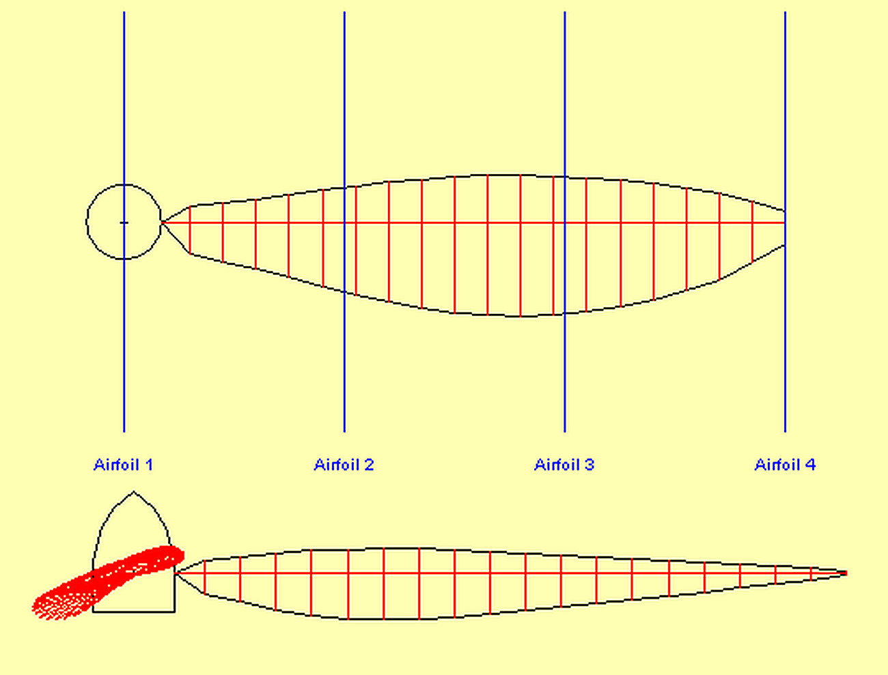
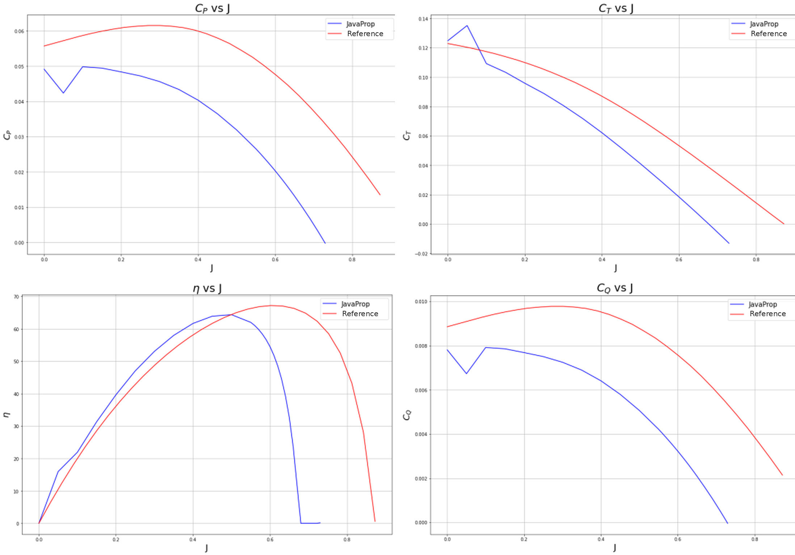
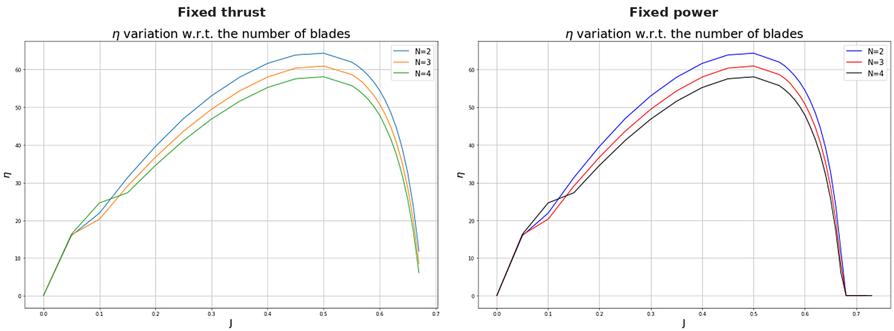

[← Back to portfolio](../)

# Propeller Performance Analysis with a Blade Element Momentum Code

*Individual coursework, AE4130 Aircraft Aerodynamics, TU Delft, 2024. Analysed in JavaProp, with the results plotted in Python.*

**Propeller aerodynamics:** blade element momentum theory · advance ratio · thrust, torque and power coefficients · propeller efficiency · effect of blade number · effect of propeller diameter

**Modelling and analysis:** JavaProp · Python · propeller geometry definition · comparison with reference data · parametric study

## Overview

This project analysed a two-blade propeller, the APC Slow Flyer 10×7, with the blade element momentum (BEM) code JavaProp. The objectives were to:

- model the propeller from its published chord and twist distribution,
- compare the predicted thrust, torque, power and efficiency with reference performance data for the same propeller,
- determine the effect of the number of blades and of the propeller diameter on the efficiency.

**My role:** individual work.

## Method

- **Propeller:** APC Slow Flyer 10×7, with a diameter of 10 inches and a pitch of 7 inches. The blade geometry was taken from the UIUC propeller database.
- **Model:** blade element momentum analysis in JavaProp. The Clark Y airfoil at a Reynolds number of 100,000 was used for all blade sections.
- **Performance analysis:** thrust, torque and power coefficients and the efficiency over the range of advance ratio, exported from JavaProp and plotted against the reference data in Python.
- **Parametric study:** two, three and four blades, and propeller diameters from 0.15 m to 0.45 m. Each variation was analysed for a design with fixed thrust and for a design with fixed power.

## Key Results

### 1. Comparison with the reference data

| Quantity | JavaProp | Reference data |
|---|---|---|
| Static thrust coefficient | 0.125 | 0.123 |
| Static power coefficient | 0.049 | 0.056 |
| Maximum efficiency | 64 % | 67 % |
| Advance ratio at maximum efficiency | 0.50 | 0.60 |
| Advance ratio at zero thrust | 0.68 | 0.87 |

*Values read from the plotted curves.*

- **Static condition:** the predicted static thrust coefficient is within 2 % of the reference value.
- **Increasing advance ratio:** the predicted thrust and power fall below the reference data. At an advance ratio of 0.4, the thrust coefficient is 0.063 against 0.088, and the power coefficient is 0.040 against 0.060.
- **Efficiency:** the maximum efficiency is predicted within 3 percentage points, at a lower advance ratio than in the reference data.

The main sources of the differences are the airfoil data and the model assumptions. One airfoil polar at one Reynolds number represents all blade sections, while the sections of the real blade differ along the span. The BEM model also does not represent the three-dimensional flow on the blade or the behaviour of stalled sections.

### 2. Effect of the number of blades

The maximum efficiency decreases with the number of blades, from about 64 % for two blades to 61 % for three and 58 % for four. The advance ratio of the maximum stays at about 0.5. The trend is the same for the designs with fixed thrust and with fixed power.

### 3. Effect of the propeller diameter

For diameters between 0.15 m and 0.45 m, the efficiency curves against the advance ratio nearly coincide, at fixed thrust and at fixed power.

## Limitations

- **Airfoil data:** a single airfoil and a single Reynolds number are used for the whole blade. The effect of the diameter on the section Reynolds number is therefore not represented, which limits the conclusion of the diameter study.
- **Model:** the BEM analysis assumes independent blade sections and does not represent radial flow or stalled operation.
- **Comparison:** the values in the table are read from the plotted curves.

[← Back to portfolio](../)
