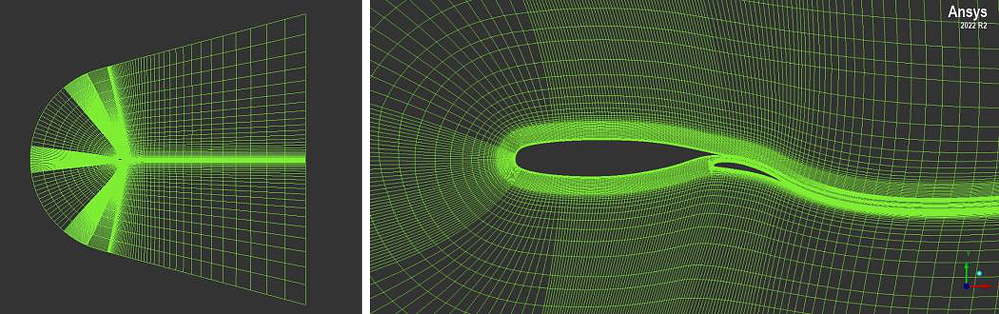
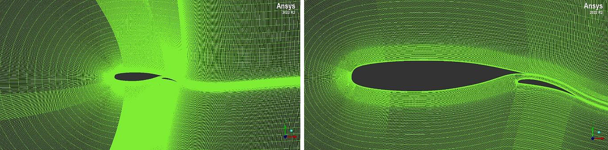
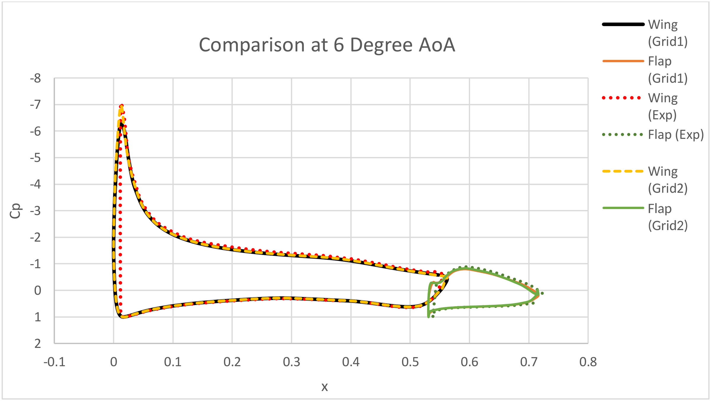
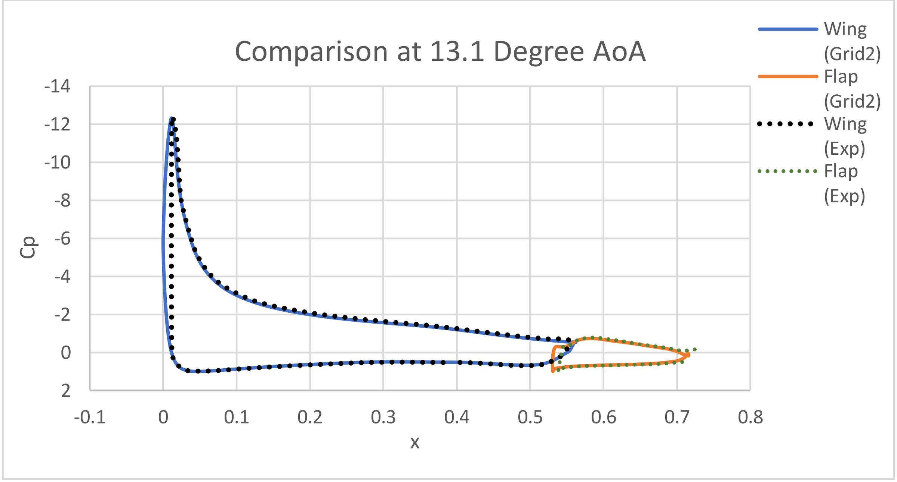
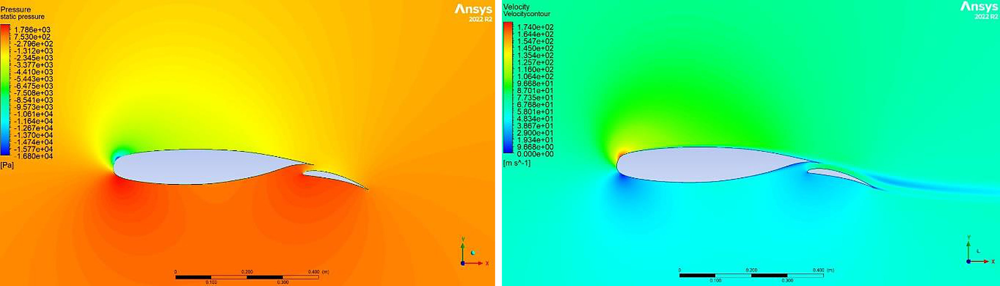
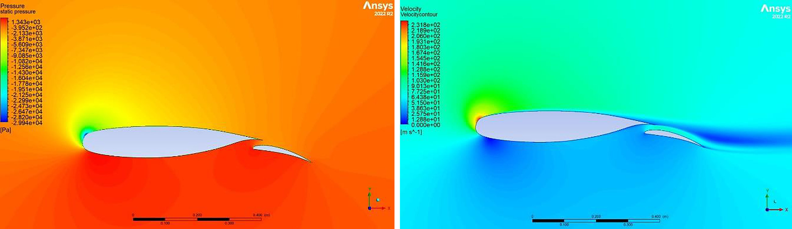

[← Back to portfolio](../)

# RANS Simulation of a Two-Element High-Lift Airfoil

*Group project (team of two), AE4202 CFD for Aerospace Engineers, TU Delft, November 2023. Meshed in ANSYS ICEM CFD and solved in ANSYS Fluent.*

**Computational fluid dynamics:** steady RANS · k-ω turbulence model · Reynolds stress model · structured multi-block mesh · C-grid · wall-resolved boundary layer (y+ < 1) · high-lift airfoil · NLR 7301

**Modelling and analysis:** ANSYS ICEM CFD · ANSYS Fluent · mesh quality assessment · grid refinement · validation against experimental data · sensitivity to discretisation scheme and turbulence model

## Overview

The NLR 7301 airfoil with a trailing-edge flap is a standard validation case for high-lift flows. This project simulated the two-element airfoil with the steady Reynolds-averaged Navier-Stokes (RANS) equations at angles of attack of 6° and 13.1°, a chord Reynolds number of 2.51 × 10⁶ and a Mach number of 0.185. The objectives were to:

- generate a structured multi-block mesh that resolves the boundary layers on both elements,
- compare the computed surface pressure, lift and drag with experimental reference data,
- quantify the effect of the grid resolution, the order of the discretisation scheme and the turbulence model on the results.

The same case was analysed with a panel method in a separate project: [Two-Element High-Lift Airfoil in JavaFoil](javafoil-high-lift).

**My role:** member of a two-person team that generated the meshes, ran the simulations and wrote the report.

## Numerical Setup

### Flow conditions and domain

- **Flow conditions:** Mach number 0.185, static temperature 293 K, static pressure 101,325 Pa. This gives a freestream velocity of 63.5 m/s and a reference chord of 0.596 m. Air is modelled as a compressible ideal gas with the viscosity from Sutherland's law.
- **Geometry:** main element and flap at a flap angle of 20°, defined by the coordinate files of the airfoil.
- **Domain:** semicircular inlet with side boundaries diverging at 15°. This shape accepts inflow directions between −15° and 15°, so the angle of attack is changed through the inflow direction on the same mesh.

### Mesh

- **Topology:** structured multi-block C-grid generated in ANSYS ICEM CFD, with separate blocks for the boundary layers around the two elements and for the wake.
- **Coarse grid:** 23,676 cells. Mean orthogonal quality 0.95, minimum angle 40°.
- **Fine grid:** 200,962 cells on the same blocking, with a first-cell height of 1 × 10⁻⁶ m. The resulting y+ is below 1 on both elements, except for a small part of the flap at about 1.1. Mean orthogonal quality 0.96, minimum angle 41°.

### Solver

- **Solver:** ANSYS Fluent, two-dimensional, steady, density-based. The first run used the pressure-based solver. The local Mach number above the main element exceeded 0.3, and the density-based solver was used for all further runs.
- **Turbulence model:** k-ω, with the energy equation active.
- **Discretisation:** higher-order scheme for the baseline runs, and a first-order upwind scheme for comparison.
- **Boundary conditions:** total pressure and flow direction at the inlet, static pressure at the outlet, no-slip walls on the airfoil.
- **Convergence:** residual criterion of 1 × 10⁻⁶, with the lift and drag coefficients monitored during the iterations.

### Simulation matrix

| Run | Grid | Angle of attack | Scheme and turbulence model |
|---|---|---|---|
| 1 | Coarse | 6° | Baseline scheme, k-ω |
| 2 | Fine | 6° | Baseline scheme, k-ω |
| 3 | Fine | 13.1° | Baseline scheme, k-ω |
| 4 | Fine | 6° and 13.1° | First-order upwind, k-ω |
| 5 | Fine | 6° and 13.1° | Baseline scheme, Reynolds stress model |

## Key Results

### 1. Surface pressure

On the fine grid, the computed pressure distribution follows the measured distribution on the main element and on the flap at both angles of attack. At 6°, the suction peak on the main element is about −7 on the fine grid and in the experiment, and about −6.3 on the coarse grid. At 13.1°, the suction peak increases to about −12.

### 2. Lift and drag

| Case | Angle of attack | Lift coefficient | Drag coefficient | Difference in lift | Difference in drag |
|---|---|---|---|---|---|
| Experiment | 6° | 2.416 | 0.0229 | | |
| Coarse grid, k-ω | 6° | 2.388 | 0.0469 | −1.2 % | +105 % |
| Fine grid, k-ω | 6° | 2.400 | 0.0337 | −0.7 % | +47 % |
| Fine grid, first-order upwind | 6° | 2.222 | 0.1000 | −8.0 % | +337 % |
| Fine grid, Reynolds stress model | 6° | 2.337 | 0.0349 | −3.3 % | +52 % |
| Experiment | 13.1° | 3.141 | 0.0445 | | |
| Fine grid, k-ω | 13.1° | 3.161 | 0.0647 | +0.6 % | +45 % |
| Fine grid, first-order upwind | 13.1° | 2.450 | 0.2031 | −22.0 % | +356 % |

- **Lift:** on the fine grid, the lift coefficient is within 0.7 % of the experiment at both angles of attack.
- **Drag:** the drag coefficient is overpredicted in all runs. Refining the grid reduces the difference at 6° from 105 % to 47 %.

### 3. Flow field

The contours show the stagnation regions on the lower side of both elements, the suction region over the nose of the main element and the flow through the gap onto the upper side of the flap. At 13.1°, the low-velocity wake above the flap is thicker.

### 4. Effect of the discretisation scheme

With the first-order upwind scheme, the lift coefficient is 8 % too low at 6° and 22 % too low at 13.1°, and the drag coefficient is more than four times the measured value. The numerical diffusion of the first-order scheme therefore dominates the result on this grid.

### 5. Effect of the turbulence model

At 6°, the Reynolds stress model gives nearly the same drag coefficient as the k-ω model (0.0349 against 0.0337) and a lower lift coefficient. At 13.1°, the Reynolds stress model did not converge, also when the run was initialised from the converged k-ω solution.

## Limitations

- **Drag prediction:** the drag coefficient on the fine grid is about 45 % above the experiment. The lowest-quality cells are in the curved wake region of the mesh, which is the first candidate for further refinement.
- **Convergence at 13.1°:** the residuals did not reach the convergence criterion. The solution was accepted because the lift and drag coefficients had stabilised.
- **Turbulence modelling:** the boundary layers are treated as fully turbulent, and laminar-turbulent transition is not modelled. The comparison with the Reynolds stress model is available at 6° only.

[← Back to portfolio](../)
