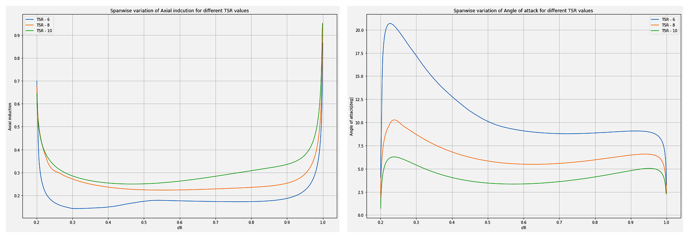
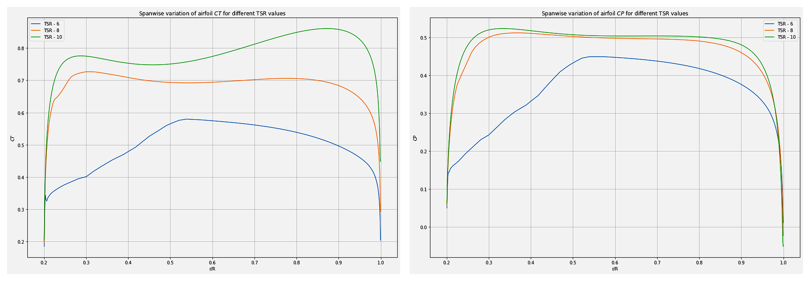
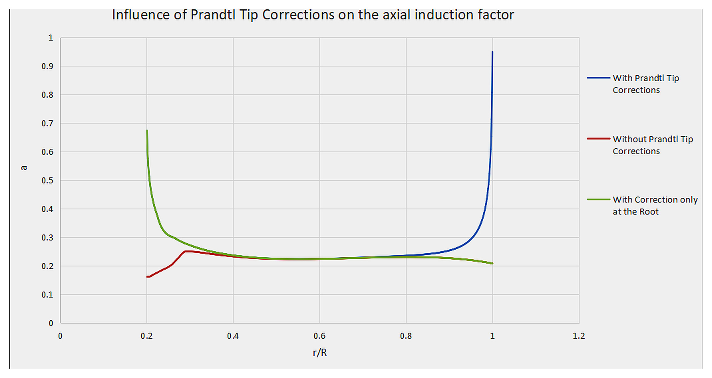
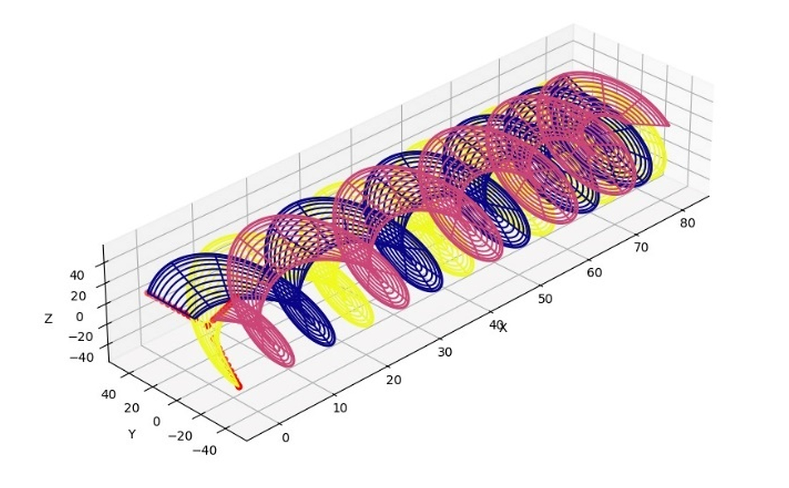
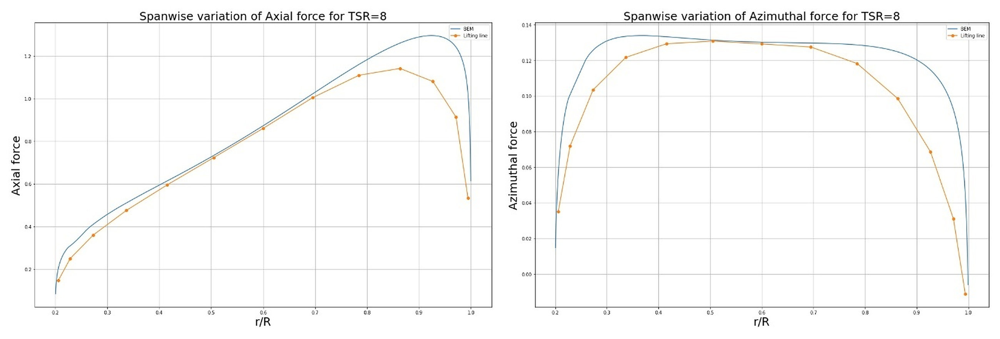
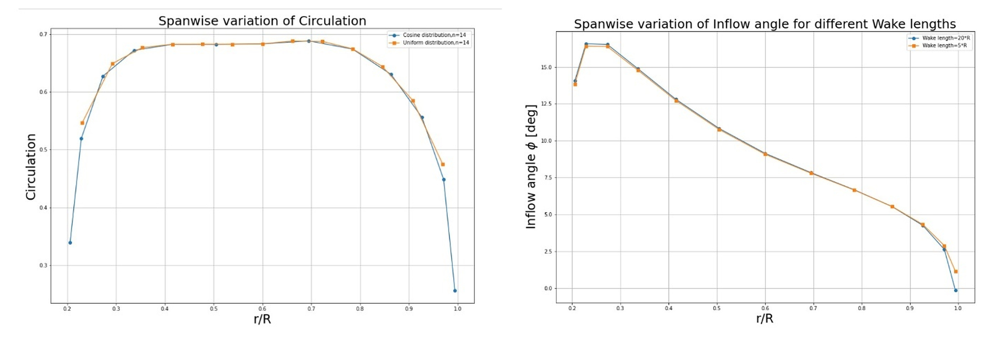
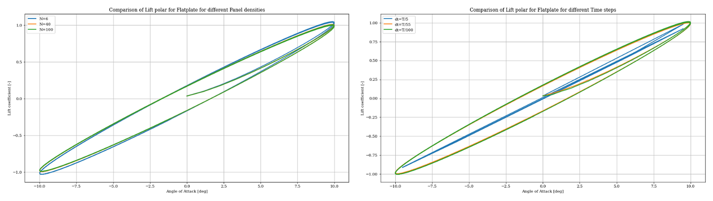
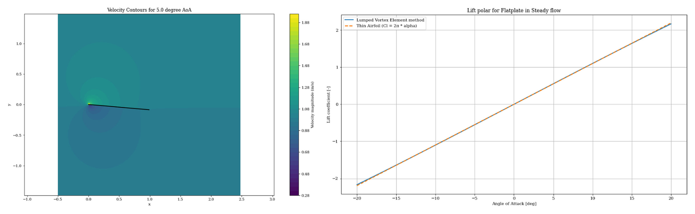
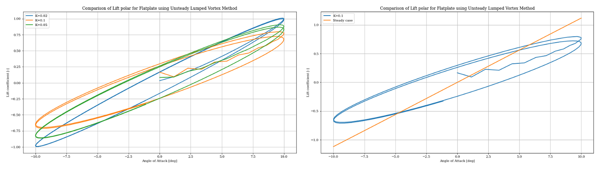

[← Back to portfolio](../)

# Rotor Aerodynamics: BEM, Lifting-Line and Unsteady Panel Models

*Group project (team of three), AE4135 Rotor/Wake Aerodynamics, TU Delft, April to July 2024. Three numerical models written in Python.*

**Aerodynamics:** blade element momentum theory · lifting-line theory · frozen wake model · vortex panel method · unsteady aerodynamics · wind turbine rotor

**Modelling and analysis:** Python · numerical model development · verification against theory · model-to-model comparison · convergence and sensitivity studies · technical reporting

## Overview

This project developed three aerodynamic models of increasing fidelity in Python and compared their results:

1. **Blade element momentum (BEM) model** of a wind turbine rotor in axial flow.
2. **Lifting-line model with a frozen wake** of the same rotor, compared against the BEM model.
3. **Unsteady vortex panel model** of a flat plate in two-dimensional potential flow, for steady and pitching motion.

**My role:** member of a three-person team that wrote the three models and the reports.

## 1. Blade Element Momentum Model

### Method

- **Model:** The rotor disc is divided into annuli. For each annulus, the blade element forces from the airfoil polar are balanced against the momentum change of the flow, and the axial and azimuthal induction factors are iterated until they converge.
- **Corrections:** Prandtl tip and root corrections for the finite number of blades, and the Glauert correction for heavily loaded rotors.
- **Inputs:** the polar of the DU 95-W-180 airfoil, the blade geometry and the operating conditions.
- **Cases:** tip speed ratios of 6, 8 and 10.

### Results

| Tip speed ratio | Thrust coefficient | Torque coefficient | Power coefficient |
|---|---|---|---|
| 6 | 0.490 | 0.060 | 0.363 |
| 8 | 0.656 | 0.056 | 0.447 |
| 10 | 0.765 | 0.046 | 0.457 |

- The axial induction increases with tip speed ratio, and the angle of attack decreases along the whole blade.
- At a tip speed ratio of 6, the inboard part of the blade operates beyond the stall angle of the airfoil, which lowers the power coefficient.
- The power coefficient is highest at a tip speed ratio of 10 and nearly as high at 8.

The Prandtl correction raises the axial induction near the tip and the root, and lowers the local thrust, torque and power there.

## 2. Lifting-Line Model with a Frozen Wake

### Method

- **Model:** each blade is represented by horseshoe vortices with the bound vortex at the quarter-chord line. The trailing vortices form a helical wake that is convected at a prescribed velocity and does not deform.
- **Solution:** the velocities induced by all vortex filaments are computed with the Biot-Savart law and assembled into influence matrices. The bound circulation is iterated until it is consistent with the lift from the airfoil polar.
- **Discretisation:** uniform and cosine spanwise spacing were both implemented.

### Results

| Tip speed ratio | Thrust coefficient, BEM | Thrust coefficient, lifting line | Power coefficient, BEM | Power coefficient, lifting line |
|---|---|---|---|---|
| 6 | 0.490 | 0.457 | 0.363 | 0.322 |
| 8 | 0.656 | 0.604 | 0.447 | 0.384 |
| 10 | 0.765 | 0.749 | 0.457 | 0.445 |

*Lifting-line values for the cosine spacing.*

- The two models agree over the middle part of the blade. The differences are at the root and the tip, where the lifting-line model predicts lower loads.
- The lifting-line model gives thrust and power coefficients below the BEM values at all three tip speed ratios.

A sensitivity study covered the spanwise spacing, the assumed wake convection speed, the number of wake segments per rotation and the wake length. The cosine spacing resolves the root and tip regions better than the uniform spacing for the same number of elements.

## 3. Unsteady Vortex Panel Model

### Method

- **Model:** a flat plate is divided into panels, each with a lumped vortex at its quarter-chord point and a collocation point at its three-quarter-chord point. The circulation follows from the condition of zero normal velocity at the collocation points.
- **Unsteady extension:** the plate pitches sinusoidally with an amplitude of 10°. A vortex is shed into the wake at every time step so that the total circulation is conserved (Kelvin condition).
- **Cases:** steady flow at angles of attack from −5° to 10°, and pitching motion at reduced frequencies of 0.02, 0.05 and 0.1.
- **Convergence:** 40 panels and a time step of 1/55 of the pitching period were selected from a convergence study.

**Related work:** the steady solver was also applied in AE4130 Aircraft Aerodynamics, where the pressure distribution on the flat plate at 6° was compared with data for the NACA 0006 airfoil.

### Results

- **Steady case:** the computed lift curve matches the thin-airfoil result, a lift coefficient of 2π times the angle of attack.

- **Pitching case:** the lift follows a hysteresis loop. At a reduced frequency of 0.02, the loop stays close to the steady lift curve. At higher reduced frequencies, the loop widens, and the lift amplitude decreases, because the shed wake vorticity opposes the change in circulation on the plate.

## Limitations

- **BEM model:** a single airfoil polar at one Reynolds number is used for the whole blade, although the Reynolds number varies along the span.
- **Lifting-line model:** the wake convection speed is prescribed from an assumed induction factor and is not updated during the iteration, which contributes to the differences from the BEM model at the root and the tip.
- **Panel model:** the flow is inviscid and incompressible, the plate has no thickness or camber, and the non-circulatory loads are not included. Flow separation and dynamic stall are therefore not represented.

[← Back to portfolio](../)
