[← Back to portfolio](../)

# MSc Thesis: Unsteady Surface Pressure in a Propeller Slipstream

*MSc thesis, TU Delft, Aerodynamics & Wind Energy, 2025. Full title: "Quantifying Unsteady Surface Pressure Fluctuations Induced by a Propeller Slipstream Using a Flexible PCB Measurement Device". [Read the full thesis](https://resolver.tudelft.nl/uuid:d76e911a-a6f4-4718-b5b9-d69512647b58).*

## Overview

A wing behind a propeller is hit by the tip vortex and the blade wake of every passing blade. That changes the loading on the wing, where the boundary layer turns turbulent, and the noise. Very little unsteady surface-pressure data has been published for a propeller running in negative thrust, the regime used for regenerative braking. That gap is what the thesis set out to fill.

The measurements were made with a flexible printed circuit board that carries 18 microphones and 6 pressure sensors and wraps around the leading edge of a model, so no holes have to be drilled. The board is a prototype of a larger one developed for flight tests on a Cessna Skymaster. It had to prove itself in a wind tunnel first, so the work ran in two campaigns:

1. **Validation.** Check the microphones and pressure sensors against known references.
2. **Propeller slipstream.** Use the board on an airfoil behind a propeller, in positive and negative thrust.

**My role:** installed and calibrated the board, planned the test matrix of 12 cases, ran both campaigns including the oil-flow visualisation, and processed the data in MATLAB and Python.

## Experimental Setup

### The sensor board

- 18 Knowles SPW0690LM4H-1 MEMS microphones and 6 Bosch BMP390 absolute pressure sensors on a 350 × 150 mm board.
- Rigid sensor strips 0.6 mm thick, joined by Kapton flex so the board bends around a leading edge.
- An FPGA reads every channel at 1.11 MHz and records the propeller shaft encoder on the same clock.

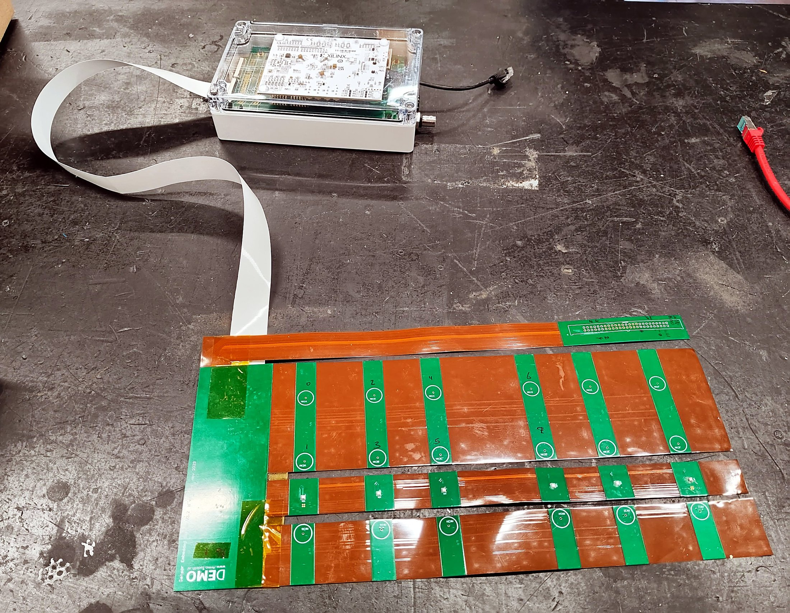

### Campaign 1: validation in the M-Tunnel

- **Facility:** M-Tunnel, Low-Speed Wind Tunnel Laboratory, TU Delft. Open-jet configuration, 400 × 400 mm test section.
- **Model:** aluminium NACA 63₃-018, 200 mm chord, with 27 pressure taps.
- **Microphone checks:** a 500 Hz tone, a GRAS pistonphone calibration (1 kHz, 114 dB), and the vortex shedding from a 19.05 mm cylinder placed 267 mm upstream, at 5 to 20 m/s.
- **Pressure sensor check:** board readings against the pressure taps and XFOIL.

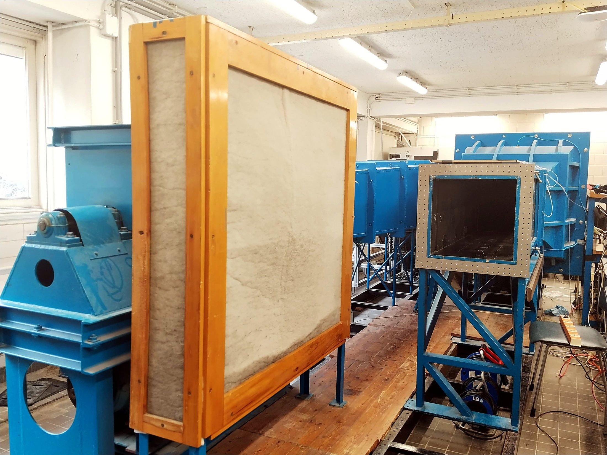

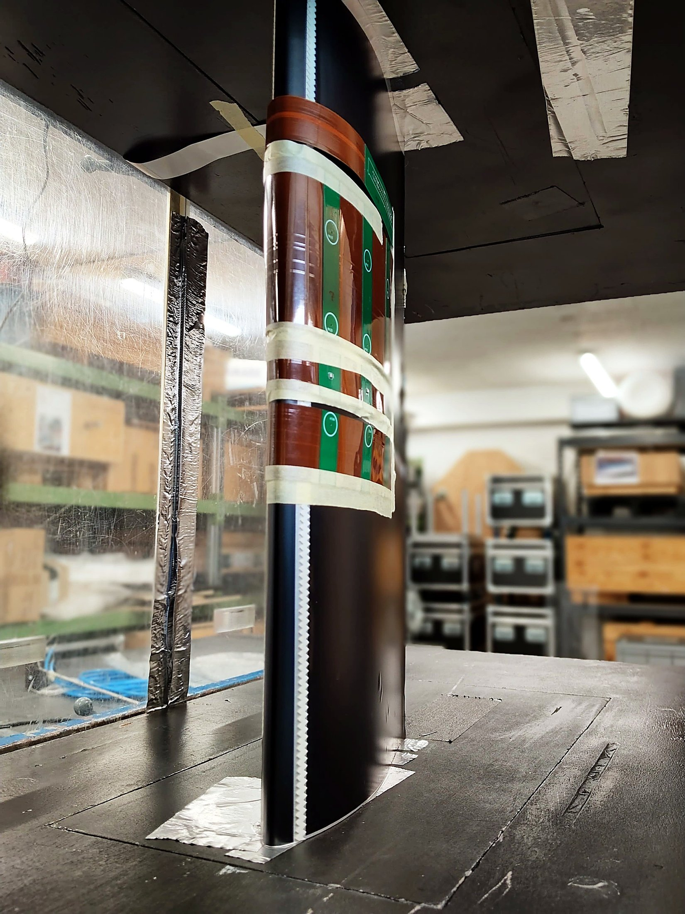

### Campaign 2: propeller slipstream in the Small Low-Turbulence Tunnel

- **Facility:** Small Low-Turbulence Tunnel (SLT), 600 × 900 mm test section, 20 m/s.
- **Model:** the same airfoil, 600 mm span, mounted vertically on rotating sideplates to set the angle of attack (0° and 6° for the main cases, 9° for two extra ones).
- **Propeller:** TUD-XPROP-S, 6 blades, 203.2 mm diameter, on a sting one propeller diameter upstream of the airfoil.
- **Operating points:** advance ratio J = 0.8 (high positive thrust, 123 rev/s) and J = 1.8 (54.7 rev/s). At J = 1.8 the propeller with 45° blade pitch gives positive thrust and the one with 30° gives negative thrust, so the two regimes are compared at the same J. Nacelle-only runs give the baseline.
- **Spanwise coverage:** the board stays fixed and the sting is moved vertically, so each run samples a different spanwise position.
- **Flow visualisation:** fluorescent oil under UV light for each case.

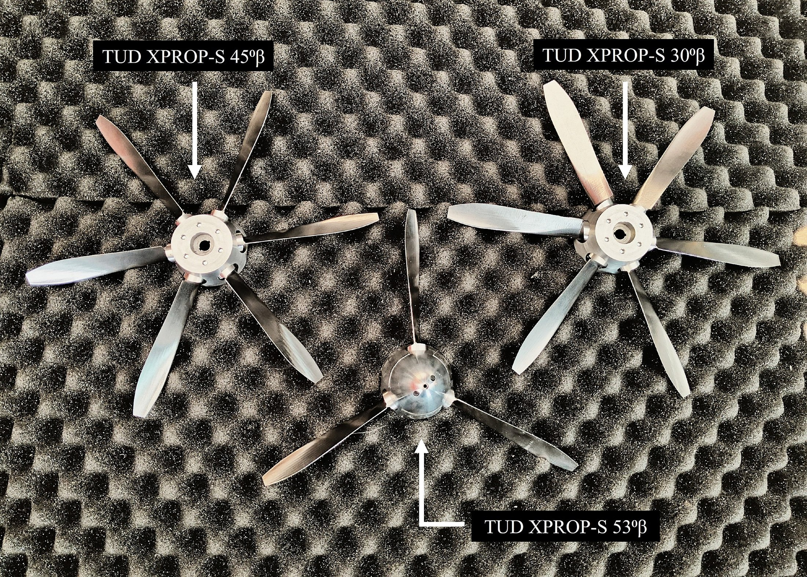

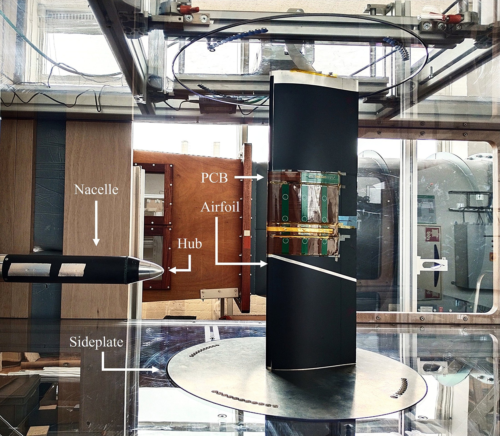

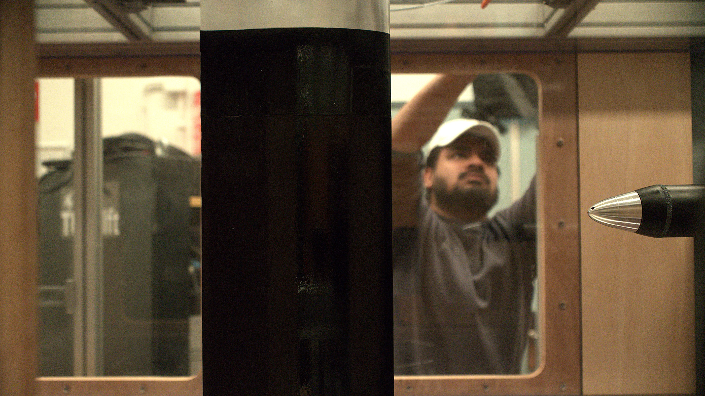

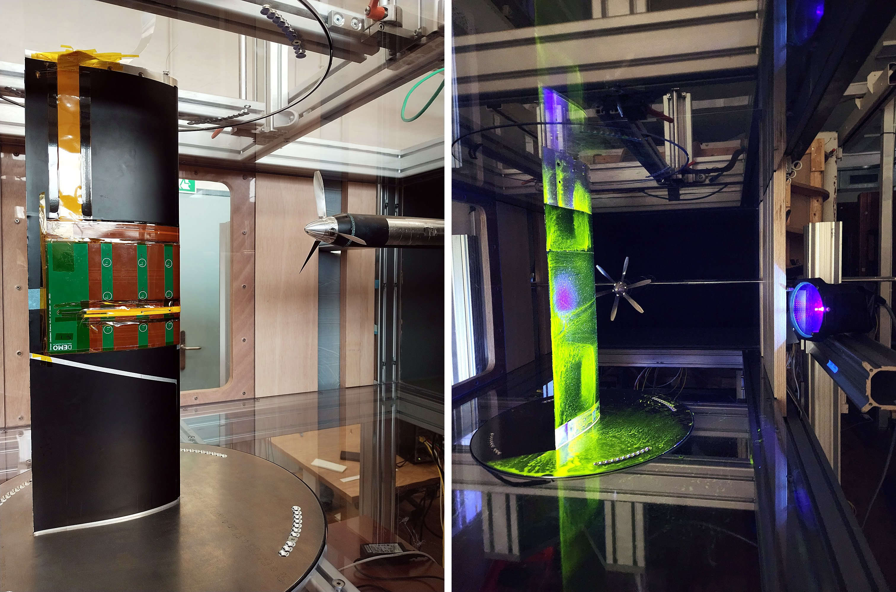

*Left: the propeller on its nacelle, upstream of the airfoil with the sensor board. Right: the same setup during an oil-flow run, with the airfoil coated in fluorescent oil under UV light.*

## Method

- **Spectra:** power spectral density with Welch's method, Hanning window, 50% overlap.
- **Fluctuation maps:** the RMS of the pressure fluctuation at each microphone and each spanwise position, assembled into a map over chord and span.
- **Phase-locked averaging:** the once-per-revolution encoder signal cuts the microphone data into single revolutions. Averaging them keeps what repeats with every blade and removes the random turbulence.

## Key Results

### 1. The microphones measure what they should

The 500 Hz tone was measured at 499.6 Hz. Behind the cylinder at 20 m/s the spectrum peaks at 210.4 Hz, a Strouhal number of 0.2003 against the textbook 0.2. Across 5, 10, 15 and 20 m/s the peak moved linearly with speed (52, 107, 161 and 210 Hz), with the Strouhal number staying between 0.199 and 0.204.

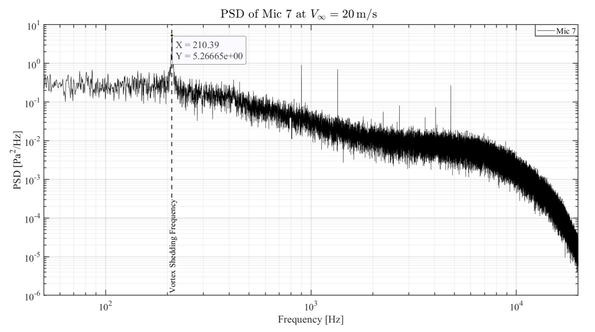

### 2. A sensor fault, found and fixed

In the first campaign the pressure sensors read far more suction than the pressure taps and XFOIL, at all four mounting positions of the board. The cause was mechanical: the sensors stand 0.75 mm proud of the surface, and the flow accelerating over them lowers the local pressure.

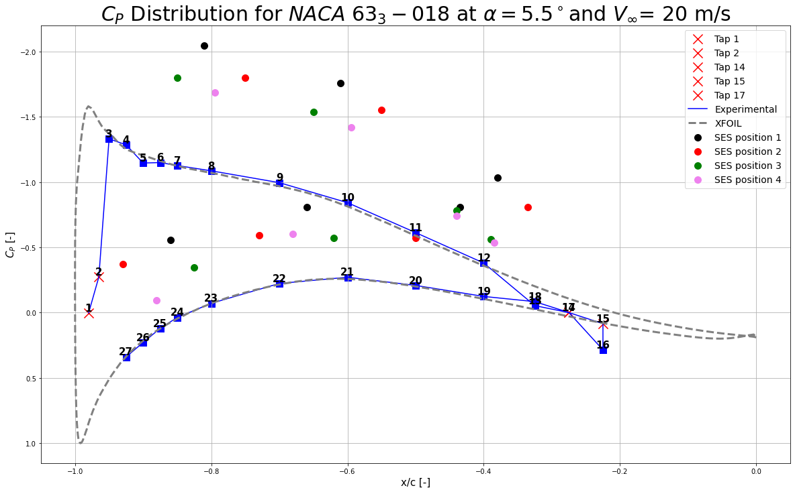

For the second campaign I built the surface up to sensor height with a strip of Kapton tape next to the sensors, which removes the step. The board then agreed with the taps and XFOIL.

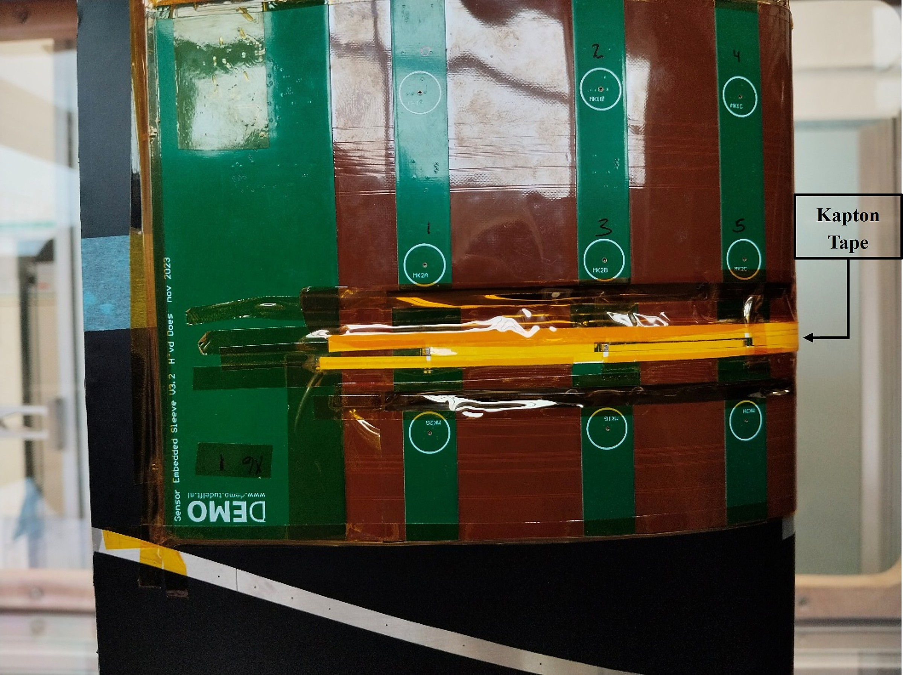

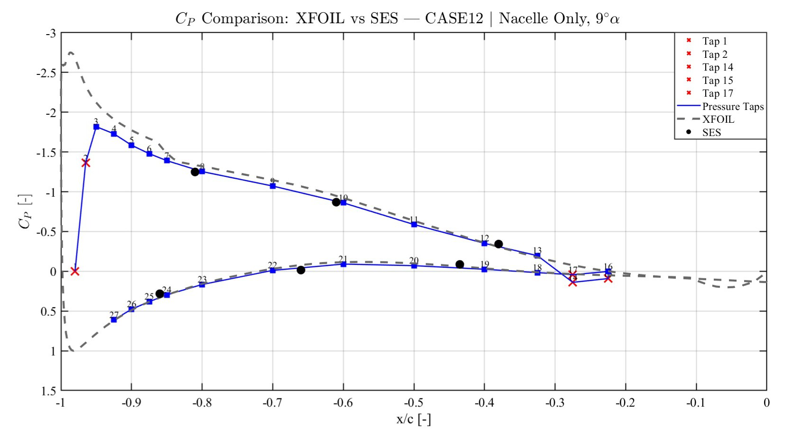

The fix had a cost. The tape disturbed the flow over the middle and lower microphone rows, so the analysis relies on the upper row. Both effects are reported in the thesis as limitations of the board.

### 3. The board picks up the laminar separation bubble

With the nacelle only, the band of high pressure fluctuation marks the separated shear layer of the laminar separation bubble. Going from 0° to 6° moves that band upstream, which matches the oil-flow pictures.

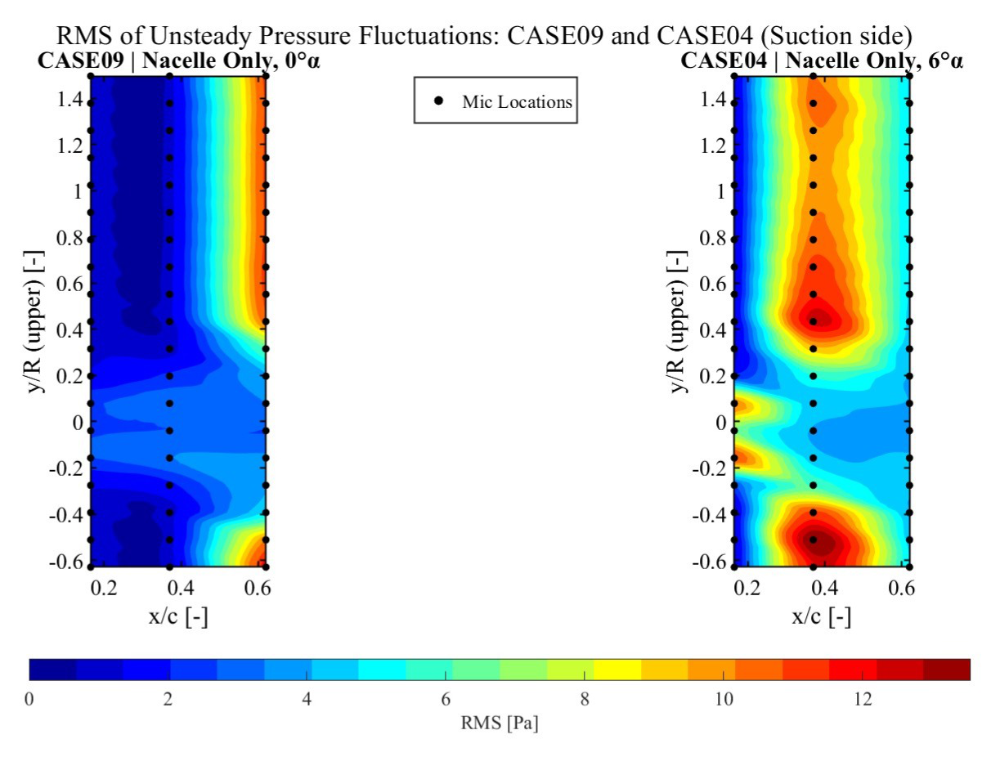

### 4. In positive thrust, the tip vortex dominates

At J = 0.8 the slipstream sweeps the separation bubble away, and the strongest fluctuations follow the trace of the tip vortex along the chord at y/R = 0.91.

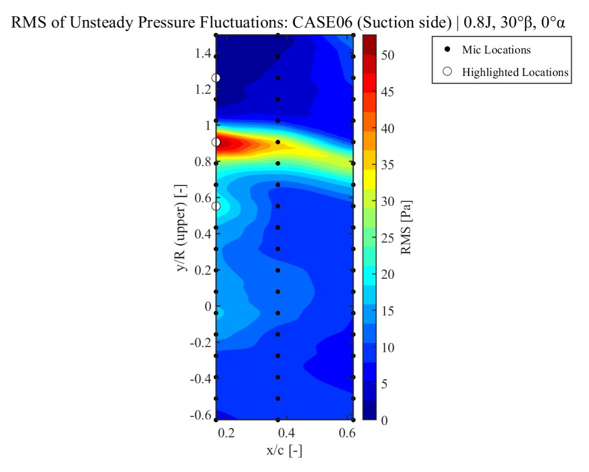

The phase-averaged signal there shows six sharp pressure dips per revolution, one for each blade. Further inboard, in the blade wake, the dips are weaker. Outside the slipstream the signal is almost flat. The spectra show the matching tones at the blade passing frequency and its harmonics, in agreement with the literature.

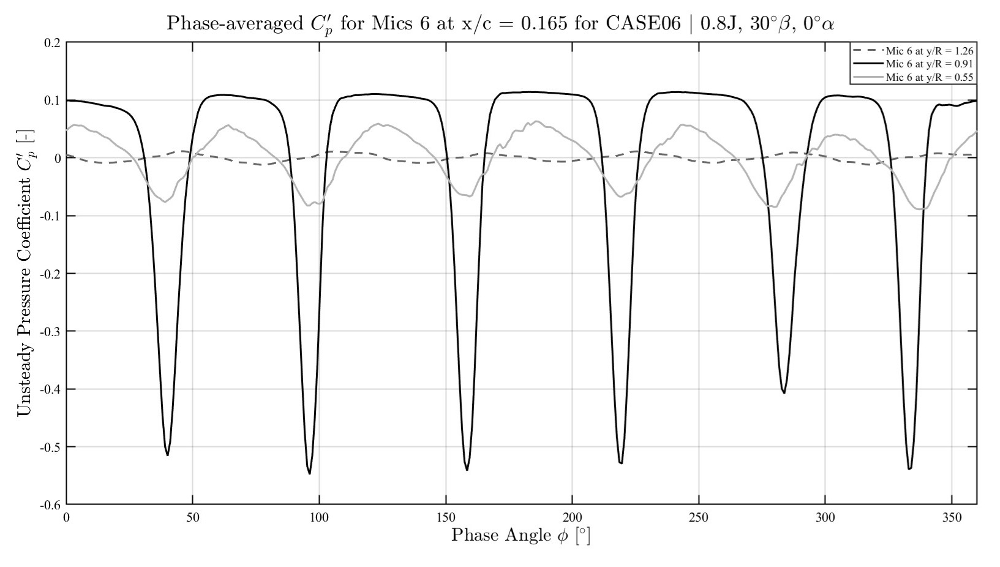

### 5. In negative thrust, the vortex is weaker and the spectrum turns broadband

At J = 1.8 and 0°, the positive-thrust case still shows a sharp dip at every blade passage. In negative thrust the dips are shallow and spread over a wider range of phase angles. The blade-passing tones decay and broadband fluctuations take over. The likely reason is the blade loading: in negative thrust the tips carry little load, so the tip vortex is weak.

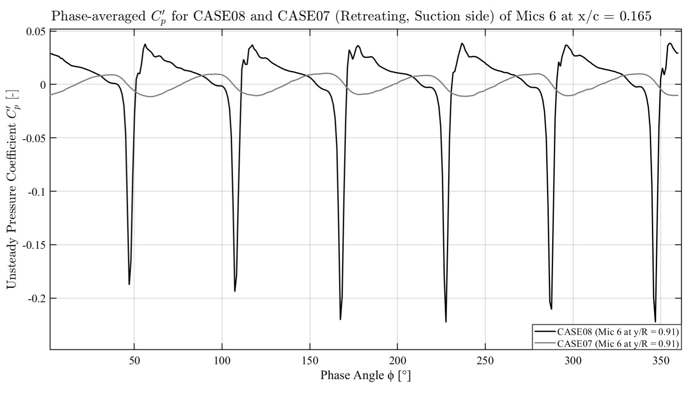

Two further findings:

- The slipstream affects the airfoil well beyond its own edge, across the whole span that was measured.
- In negative thrust the highest fluctuations are not on the tip-vortex trace. They sit where the slipstream meets the shear layer of the separation bubble.

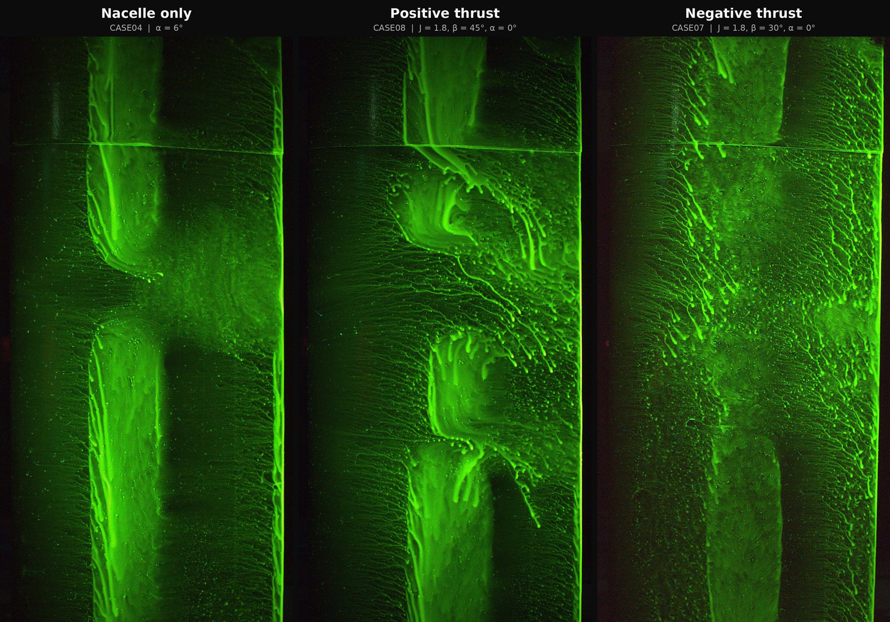

## Limitations

- **Sensor height.** The 0.75 mm step needs a flush sleeve. Tape fixes the pressure sensors but disturbs the microphones next to it.
- **Recording length.** The acquisition was set to 30 s, but the board saved less than 10 s in most cases.
- **Resolution.** The layout comes from the Skymaster design. There are only three chordwise microphone stations per side, and the first sits at 16.5% chord, so the leading edge itself is not covered.

[← Back to portfolio](../)
