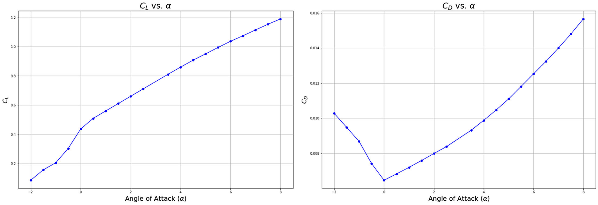
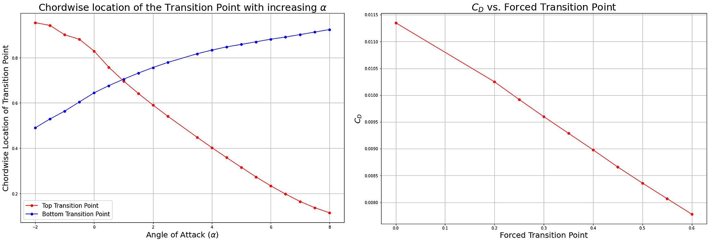
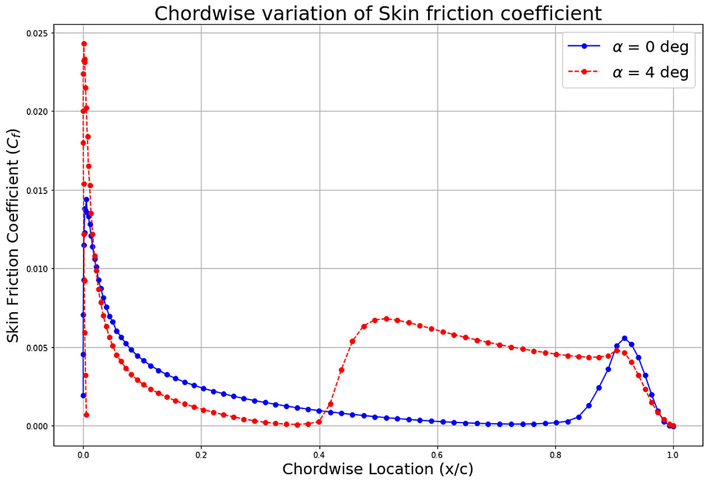
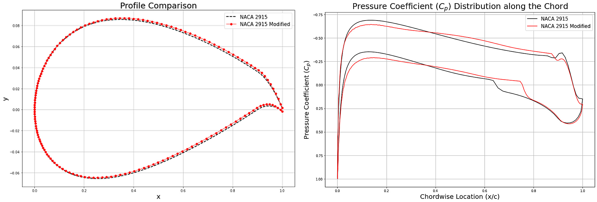
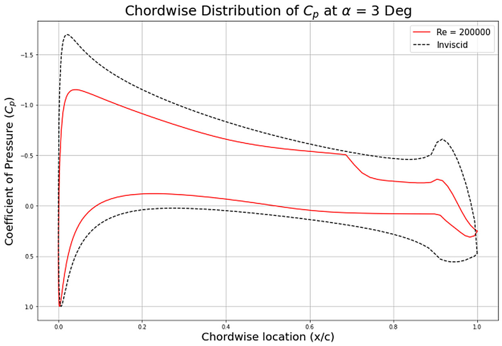

[← Back to portfolio](../)

# Airfoil Analysis and Redesign in XFOIL: Transition and Laminar Separation Bubble

*Individual coursework, AE4130 Aircraft Aerodynamics, TU Delft, 2024. Analysed in XFOIL, with the results plotted in Python.*

**Aerodynamics:** airfoil analysis · boundary-layer transition · laminar separation bubble · skin friction · inverse airfoil design · lift-to-drag ratio · low Reynolds number

**Modelling and analysis:** XFOIL · Python · viscous airfoil analysis · transition prediction with the e^N method · forced transition study · inverse design

## Overview

This project analysed and modified a NACA 2915 airfoil in XFOIL in three parts:

1. **Analysis:** lift, drag, transition location and skin friction at a Reynolds number of 0.7 × 10⁶.
2. **Redesign:** modification of the airfoil with the inverse design routines of XFOIL, to increase the extent of laminar flow and the lift-to-drag ratio at a lift coefficient of 0.4 without changing the relative thickness.
3. **Laminar separation bubble:** identification of a bubble at a Reynolds number of 2 × 10⁵, and its removal by fixing the transition location.

**My role:** individual work.

## Method

- **Airfoil:** NACA 2915, with a relative thickness of 15 %.
- **Analysis conditions:** angles of attack from −2° to 8°, Reynolds number 0.7 × 10⁶, incompressible flow, and a critical amplification factor of 12 for the transition prediction.
- **Forced transition:** at a lift coefficient of 0.4, the transition on the upper surface was fixed at positions between the leading edge and 60 % chord.
- **Redesign:** the pressure distribution was modified with the inverse design routines at a lift coefficient of 0.4, and the resulting airfoil was analysed at the same conditions.
- **Laminar separation bubble:** Reynolds number 2 × 10⁵ and an angle of attack of 3°, which gives a lift coefficient of 0.628. The transition on the upper surface was then fixed at positions from 10 % to 60 % chord at this lift coefficient.

## Key Results

### 1. Lift, drag and transition

- **Drag:** the drag coefficient has its minimum of about 0.0065 at an angle of attack of 0°.
- **Transition:** with increasing angle of attack, the transition on the upper surface moves forward, from about 96 % chord at −2° to about 11 % chord at 8°. On the lower surface it moves aft, from about 49 % to about 93 % chord.

- **Forced transition:** at a lift coefficient of 0.4, the drag coefficient increases the further forward the transition is fixed, from about 0.0078 at 60 % chord to about 0.0113 at the leading edge. With free transition at 85 % chord, it is 0.0066.
- **Skin friction:** the skin friction coefficient on the upper surface rises at the transition location, at about 85 % chord at 0° and about 40 % chord at 4°.

### 2. Redesign for a higher lift-to-drag ratio

| Quantity at a lift coefficient of 0.4 | NACA 2915 | Modified airfoil |
|---|---|---|
| Drag coefficient | 0.00656 | 0.00630 |
| Friction drag coefficient | 0.00393 | 0.00368 |
| Lift-to-drag ratio | 60.96 | 63.52 |
| Transition on the upper surface | 85 % chord | 87 % chord |
| Transition on the lower surface | 63 % chord | 75 % chord |

- The lift-to-drag ratio increases by 4.2 % at the same relative thickness.
- The reduction in drag is a reduction in friction drag. The largest change is on the lower surface, where the transition moves aft by about 12 % chord.
- The gain on the upper surface is small because the transition of the original airfoil is already far aft at this lift coefficient.

### 3. Laminar separation bubble

At a Reynolds number of 2 × 10⁵, the pressure distribution on the upper surface shows a region of nearly constant pressure that starts at about 50 % chord and is followed by a steep pressure recovery near 70 % chord. This is the signature of a laminar separation bubble. The free transition is at 69 % chord.

| Transition location on the upper surface | Drag coefficient |
|---|---|
| 69 % chord (free transition) | 0.01432 |
| 60 % chord | 0.01368 |
| 50 % chord | 0.01337 |
| 40 % chord | 0.01379 |
| 30 % chord | 0.01449 |
| 20 % chord | 0.01538 |
| 10 % chord | 0.01644 |

- Fixing the transition at 50 % chord, 19 % chord ahead of the free transition, removes the bubble and reduces the drag coefficient by 6.6 %.
- Fixing the transition further forward increases the drag again, because the longer turbulent boundary layer adds more friction drag than the removal of the bubble saves.

## Limitations

- **Method:** XFOIL is a two-dimensional panel method coupled with an integral boundary-layer formulation. The results were not compared with measurements.
- **Redesign:** the airfoil was modified manually for one lift coefficient. Its behaviour at other lift coefficients and near stall was not checked.
- **Forced transition:** the study fixes the transition location in the calculation. The size and drag of a physical trip are not included.

[← Back to portfolio](../)
