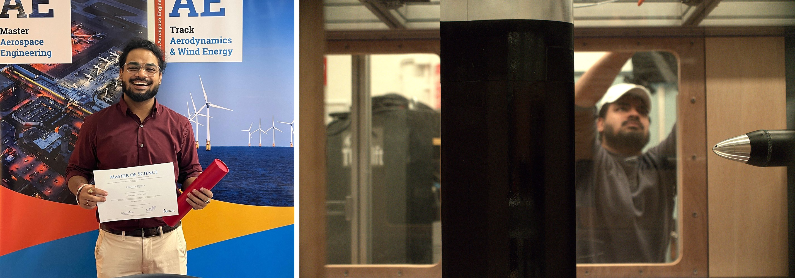

# Prantik Dutta

**Aerospace Engineer: Experimental Aerodynamics · Wind Tunnel Testing · Instrumentation · Propeller Aerodynamics**

[Email](mailto:dutta.prantik13@gmail.com) · [LinkedIn](https://www.linkedin.com/in/prantik-dutta-721447182) · [MSc Thesis](https://resolver.tudelft.nl/uuid:d76e911a-a6f4-4718-b5b9-d69512647b58) · [ORCID](https://orcid.org/0000-0003-2318-2727)

---

*Left: MSc graduation, TU Delft (Aerodynamics & Wind Energy). Right: installing the setup in the Small Low-Turbulence Wind Tunnel.*

## About

I'm an aerospace engineer with an MSc from TU Delft (Aerodynamics & Wind Energy, 2023–2025). Most of my work has been in the wind tunnel: setting up the test, installing and calibrating the instrumentation, running the campaign, and checking the data before anyone relies on it. I like the hands-on side of testing, including the troubleshooting and root-cause analysis.

My thesis studied how a propeller slipstream affects the unsteady surface pressure and acoustics on an airfoil behind it. I installed and calibrated a new flexible sensor board with 18 microphones and 6 pressure sensors, planned the test matrix, and ran the campaigns.

Alongside the experiments, I have experience with low-fidelity tools (XFOIL, JavaFoil, AVL, JavaProp) for design and aerodynamic studies and CFD (OpenFOAM, Fluent, CFX).

This site collects the experiments, analyses and design studies behind that work. Each project page shows the setup, the method and the results.

## Tools

**Experimental:** hot-wire anemometry (CTA), PIV (DaVis), oil-flow visualisation, force balances, microphone arrays, pressure sensors, LabVIEW data acquisition

**Computational:** OpenFOAM (LES), Fluent (RANS), CFX, XFOIL, JavaFoil, AVL, JavaProp

**Programming:** MATLAB, Python, LabVIEW

---

## Experimental Testing & Instrumentation

### MSc Thesis: Unsteady Surface Pressure in a Propeller Slipstream

Validated a flexible sensor board with 18 microphones and 6 pressure sensors in the wind tunnel, then used it to measure how a propeller slipstream loads an airfoil in positive and negative thrust.

📄 [Detailed description](Projects/thesis)

### Wind Tunnel Test Campaign: Stability and Control with One Engine Inoperative

In a team of four, designed and ran a 105-point test matrix on a propeller aircraft model in the TU Delft Low-Turbulence Tunnel, and quantified directional stability, rudder effectiveness, trimmed performance and propeller noise with one engine inoperative.

📄 [Detailed description](Projects/oei-test)

### Hot-Wire Anemometry and PIV: NACA 0012 Wake

Calibrated a constant-temperature hot-wire against a pitot-static reference and compared it with planar PIV on the same wake at 0°, 5° and 15° angles of attack.

📄 [Detailed description](Projects/hotwire-piv)

### Delta Wing with Winglets: Low-Speed Wind Tunnel Force Measurements

Undergraduate project and journal publication: lift and drag of a flat delta wing with three winglet configurations, measured with a six-component balance at 10 to 25 m/s.

📄 [Detailed description](Projects/delta-wing)

### PC-Based Data Acquisition in LabVIEW: Four Thermo-Fluid Dynamics Experiments

One-week course at the Czech Technical University in Prague on PC-based data acquisition. LabVIEW programs on National Instruments CompactDAQ hardware acquired the sensor signals, ran the test and logged the data in four experiments: air flow rate control, moist air properties, propeller characteristics and aerodynamic forces on a body in a wind tunnel.

📄 [Detailed description](Projects/labview-daq)

---

## Propeller and Rotor-Wake Aerodynamics

### Rotor Aerodynamics: BEM, Lifting-Line and Unsteady Panel Models

Three Python models of increasing fidelity: a blade element momentum model and a frozen-wake lifting-line model of a wind turbine rotor, compared against each other, and an unsteady vortex panel model of a pitching flat plate.

📄 [Detailed description](Projects/rotor-models)

### Propeller Performance Analysis with a Blade Element Momentum Code

Blade element momentum analysis of the APC Slow Flyer 10×7 propeller in JavaProp, compared with reference performance data, with a study of the effect of blade number and diameter on the efficiency.

📄 [Detailed description](Projects/propeller-bem)

---

## Computational Fluid Dynamics

### RANS Simulation of a Two-Element High-Lift Airfoil

Steady RANS simulations of the NLR 7301 airfoil with flap on a structured multi-block mesh (ICEM CFD, Fluent), compared with measured surface pressure, lift and drag. Lift within 0.7 % of the experiment on the fine grid.

📄 [Detailed description](Projects/rans-high-lift)

### Incompressible Navier-Stokes Solver: Lid-Driven Cavity Validation

A two-dimensional incompressible flow solver in Python, formulated with incidence and Hodge matrices and validated against the benchmark solution of the lid-driven cavity at a Reynolds number of 1000.

📄 [Detailed description](Projects/navier-stokes-solver)

### Large Eddy Simulation (LES): DNS Data Analysis and Turbulent Channel Flow

Spectral analysis and filtering of DNS data in Python to compare subgrid-scale models, and large eddy simulations of a turbulent channel flow in OpenFOAM on two grids with five model settings.

📄 [Detailed description](Projects/les)

### Vortex-Induced Vibration of a Cylinder: Fluid-Structure Interaction

Two-way fluid-structure interaction of an elastically mounted cylinder in ANSYS CFX with rigid-body coupling and a moving mesh, comparing coupling schemes, time steps and mesh deformation methods.

📄 [Detailed description](Projects/fsi-cylinder)

## Low-Fidelity Aerodynamic Analysis

### Airfoil Analysis and Redesign in XFOIL: Transition and Laminar Separation Bubble

Analysis of a NACA 2915 airfoil in XFOIL, an inverse redesign that raises the lift-to-drag ratio by 4 % at the same thickness, and removal of a laminar separation bubble by fixing the transition, which lowers the drag by 7 %.

📄 [Detailed description](Projects/xfoil-airfoil)

### Two-Element High-Lift Airfoil in JavaFoil: Panel Method against Experiment

Lift curve of the NLR 7301 airfoil with flap from a panel method with three stall models, compared with experimental data and with the RANS simulation of the same case.

📄 [Detailed description](Projects/javafoil-high-lift)

### Winglet and Wing Planform Study with a Vortex Lattice Method

Induced drag of a wing with a winglet at cant angles from 0° to 90° in AVL: 15 % reduction for the vertical winglet and 24 % for the tip extension.

📄 [Detailed description](Projects/avl-winglet)

---

## Industry Project

### Hydrogen-Powered Blended Wing Body Aircraft: Joint Interdisciplinary Project with Airbus

Ten-week study in a team of seven with Airbus Netherlands: fuel selection, hydrogen turbofan design, tank and weight estimation and mission emissions for a blended wing body aircraft, with a cost and stakeholder analysis by the non-technical part of the team.

📄 [Detailed description](Projects/jip-airbus)

---

## Publications & Aeromodelling

### Publications

Four papers from the bachelor's degree: a first-author paper on bio-inspired slotted winglets, two co-authored papers on an albatross-inspired UAV wing with a bell-shaped lift distribution, and a single-author review.

📄 [List of publications](Projects/publications)

### Aeromodelling: RC Aircraft Design and Build

Designed and built radio-controlled aircraft from Depron and XPS foam in a student team for aeromodelling competitions during the bachelor's degree. Sized the wings for the mission (gliding or aerobatics) through aspect ratio, taper ratio and tail sizing calculations, and selected the motors, speed controllers, propellers and servos.

